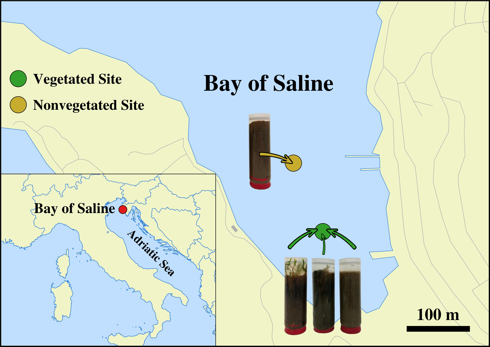

```{r knitr_settings, eval = TRUE, echo = FALSE, cache = FALSE}
opts_chunk$set("tidy" = TRUE)
opts_chunk$set("echo" = FALSE)
opts_chunk$set("eval" = TRUE)
opts_chunk$set("warning" = FALSE)
opts_chunk$set("cache" = FALSE)
opts_chunk$set("message" = FALSE)

inline_hook <- function(x){
	print(x)
  
	if(is.list(x)){
		x <- unlist(x)
	}
  
	if(is.numeric(x)){
		if(abs(x - round(x)) < .Machine$double.eps ^ 0.5){
			paste(format(x,big.mark = ',', digits = 0, scientific = FALSE))
		} else {
			paste(format(x,big.mark = ',', digits = 1, nsmall = 1, scientific = FALSE))
		}
	} else {
    	paste(x)      
	}
}
knitr::knit_hooks$set(inline = inline_hook)

```

\vspace{20mm}
Marsej Markovski^1^, Mirjana Najdek^1^, Gerhard J. Herndl^2,3^, and Marino Korlević^1$*$^

1\. Center for Marine Research, Ruđer Bošković Institute, Croatia

2\. Department of Functional and Evolutionary Ecology, University of Vienna, Austria

3\. Department of Marine Microbiology and Biogeochemistry, Royal Netherlands Institute for Sea Research (NIOZ), Utrecht University, The Netherlands

^$*$^To whom correspondence should be addressed:

Marino Korlević

G. Paliaga 5, 52210 Rovinj, Croatia

Tel.: +385 52 804 768

Fax: +385 52 804 780

e-mail: marino.korlevic@irb.hr

Running title: Compositional stability of sediment communities

\newpage
\linenumbers
\sisetup{mode=text}
\setlength\parindent{24pt}

## Abstract
The presence of seagrass shapes surface sediments and forms a specific environment for diverse and abundant microbial communities. A severe decline of *Cymodocea nodosa*, a widespread seagrass species in the Mediterranean Sea, has been documented. To characterise and assess the changes in microbial community composition during the decline of a *Cymodocea nodosa* meadow, Illumina MiSeq sequencing of the V4 region of the 16S rRNA gene was performed. Samples of surface sediments were collected at monthly intervals from July 2017 to October 2018. Samples from an adjacent, nonvegetated site were also analysed for comparison. Microbial communities were stratified by sediment depth and differed between the vegetated and the nonvegetated site. Although the *C. nodosa* meadow declined to a point where almost no leaves were present, no clear temporal succession in the community was observed. Taxonomic analysis revealed a dominance of bacterial over archaeal sequences, with most archaeal reads classified as *Nanoarchaeota*, *Thermoplasmatota*, *Crenarchaeota*, and *Asgardarchaeota*. The bacterial community was mainly composed of *Desulfobacterota*, *Gammaproteobacteria*, *Bacteroidota*, *Chloroflexi*, *Planctomycetota*, and *Campylobacterota*. Our results show that sediment microbial communities are remarkably stable and may resist major disturbances such as seagrass meadow decline.

\newpage
## Introduction
Shallow coastal sediments are often colonized by seagrasses, which cover approximately 0.1 to 0.2 % of the global ocean [@Duarte2002]. Seagrasses penetrate the sediment with their roots and rhizomes forming extensive meadows. The presence of seagrass meadows shapes surface sediments and provides a specific environment for diverse and abundant microbial communities [@Duarte2005]. Sediments colonized by seagrasses are considered hotspots for microbial activity as seagrass meadows enrich the underlying sediment with organic matter [@Duarte2005]. High organic matter content is mainly achieved by releasing dissolved organic carbon from seagrass roots and by trapping organic particles from the water column [@Duarte2002]. Moreover, seagrasses stabilize the underlying sediment, promoting the accumulation of organic matter and sediment particles [@vanKatwijk2010; @Fonseca1987; @Terrados2000]. In addition, seagrass beds can also increase the availability of organic matter indirectly through the decomposition of detached leaves, roots and rhizomes [@Jensen2007a; @Liu2017].

Studies of marine sediment microbial communities primarily focus on changes in microbial abundance and activity with sediment depth [@Jorgensen2016; @Orsi2018; @Petro2017a; @Starnawski2017a]. Depth-dependent changes in taxonomic composition have been well described differentiating surface sediment communities dominated by *Bacteria*, especially *Proteobacteria*, from deeper communities characterized by *Archaea* [@Chen2017; @Orcutt2011a; @Petro2017a]. Coastal surface sediments colonized by seagrass are not as well investigated due to studies focusing primarily on rhizosphere communities and only occasionally including sediment communities for comparison [@Cucio2016a; @Rabbani2021]. Communities in the rhizosphere are species-specific and differ from those in the sediment. One of the main differences is the higher relative abundance of *Desulfobacterota*, one of the most abundant sulphate reducing bacteria in seagrass sediments, in contrast to the rhizosphere, which is characterized by *Epsilonproteobacteria* [@Ettinger2017b]. When sediment microbial communities were described, the main focus was on the differences between vegetated and nonvegetated sites [@Zheng2019; @Sun2020]. In addition, these studies showed that communities differ even with respect to the meadow edge [@Ettinger2017b]. However, little is known about the response of these communities to seagrass decline. Only limited information is available on the succession of microbial communities in seagrass sediments including the dynamics and activity of sulphate-reducing prokaryotes [@Smith2004a], the response of microbial communities to nutrient enrichment [@Guevara2014], and community changes associated with seagrass restoration [@Bourque2015]. These studies suggest that seagrass decline may trigger changes in the sediment communities.

In the Mediterranean Sea, *Cymodocea nodosa* is a widespread seagrass species declining in coastal areas [@RuizFernandez2009; @Orlando-Bonaca2015; @Tuya2014]. The rhizosphere and epiphytic communities of *C. nodosa* have been described [@Cucio2016a; @Korlevic2021a], however, little is known about sediment communities underlying *C. nodosa* meadows. The aim of the present study was to characterize the taxonomic composition of sediment communities of a *C. nodosa* meadow and to assess the temporal dynamics of these communities. As the studied meadow experienced a major decline [@Najdek2020], we investigated whether this event affected the sediment microbial community structure.

\newpage
## Materials and methods
### Sampling
Sediment cores were sampled in a declining *C. nodosa* meadow (vegetated site) located in the Bay of Saline, east coast of the northern Adriatic Sea (\ang{45;7;5} N, \ang{13;37;20} E) (\autoref{map}). Cores were collected monthly from July 2017 to October 2018 (Supplementary \autoref{supp-nseq_notus}) by diving using 15 cm long plastic core samplers. Sediment samples were immediately transported on ice to the laboratory and stored at \num{-80} \si{\degreeCelsius} until further processing. The adjacent nonvegetated area was also sampled for comparison (\autoref{map}). A detailed description of the study site, the decline of the *C. nodosa* meadow and the dynamics of environmental conditions during the decline are provided in @Najdek2020.

### DNA isolation
Total DNA from sediment samples was extracted following a modified [@Pjevac2018b] isolation protocol of @Zhou1996b. Prior to DNA isolation, cores were cut into four different 1 \si{\cm} sections: top (0 -- 1 \si{\cm}), bottom (7 -- 8 \si{\cm}), and two middle sections: upper middle (1 -- 3 \si{\cm}) and lower middle (3 -- 6 \si{\cm}) section. Sediment samples were weighted (2 \si{\g}) avoiding roots and rhizomes from vegetated cores, mixed with 5.4 \si{\ml} of extraction buffer (100 \si{\milli\Molar} Tris [pH 8.0], 100 \si{\milli\Molar} sodium EDTA [pH 8.0], 100 \si{\milli\Molar} \ch{Na3PO4} [pH 8.0], 1.5 \si{\Molar} NaCl, 1 \si{\percent} CTAB) and 10 \si{\ul} of proteinase K (20 \si{\mg\per\ml}) and incubated by horizontal shaking at 225 rpm at 37\si{\degreeCelsius} for 30 \si{\minute}. Thereafter 1.2 \si{\ml} of 10 \si{\percent} SDS was added and the mixture incubated again by horizontal shaking at 225 rpm at 65\si{\degreeCelsius} for 60 \si{\minute}. The supernatant was collected after centrifugation at 3220 × g at room temperature for 10 \si{\minute} and mixed with an equal volume of chloroform:isoamyl alcohol (1:1). The aqueous phase was retrieved after centrifugation at 3220 × g at room temperature for 10 \si{\minute}. The extraction procedure with the organic solvent mixture was repeated twice. After the final extraction 0.6 volumes of isopropanol were added to precipitate the DNA. The mixture was incubated at 22\si{\degreeCelsius} for 60 \si{\minute} and centrifuged at 3220 × g at room temperature for 45 \si{\minute}. The obtained pellet was washed twice with 10 \si{\ml} of chilled 70 \si{\percent} ethanol, centrifuged at 3220 × g at room temperature for 10 \si{\minute} after each washing, and finally resuspended in 100 \si{\ul} of deionized water.

### Illumina 16S rRNA sequencing
The V4 region of the 16S rRNA gene was sequenced using a two-step PCR approach described previously [@Korlevic2021]. Briefly, the V4 region was amplified using the 515F ($5'$-GTGYCAGCMGCCGCGGTAA-$3'$) and 806R ($5'$-GGACTACNVGGGTWTCTAAT-$3'$) primers from the Earth microbiome project (https://earthmicrobiome.org/protocols-and-standards/16s/), which contained a sequence tag on the 5' end [@Caporaso2011a; @Caporaso2012a; @Apprill2015a; @Parada2016a]. Purified samples were sent for Illumina MiSeq sequencing (2 × 250 bp) at IMGM Laboratories (Martinsried, Germany) where the second PCR of the two-step PCR approach was performed using primers targeting the tag region incorporated in the first PCR. These primers also contained adapter and sample-specific index sequences. For each sequencing batch, a positive and a negative control were also sequenced. The positive control consisted of a mock community composed of uniformly mixed DNA from 20 different bacterial strains (ATCC MSA-1002, ATCC, USA), while PCR reactions without DNA template served as the negative control. Sequences obtained in this study have been deposited in the European Nucleotide Archive at EMBL-EBI under the accession numbers SAMEA11293274 -- SAMEA11293412 and SAMEA6648825.

### Sequence and data analysis

```{r community}
# Loading data with sequence abundances and excluding eukaryotic sequences
community <- read_tsv("data/mothur/raw.trim.contigs.good.unique.good.filter.unique.precluster.pick.silva.wang.tax.summary")
eukaryota <- filter(community, str_detect(taxon, "^Eukaryota$"))$rankID
community <- community %>%
  filter(!str_detect(rankID, paste0("^", eukaryota))) %>%
  filter(taxon != "Root")

# Removing chloroplast and mitochondrial sequences and subtracting their number from higher taxonomic levels to which they belong
chloroplast <- filter(community, str_detect(taxon, "^Chloroplast$"))$rankID
mitochondria <- filter(community, str_detect(taxon, "^Mitochondria$"))$rankID
community <- community %>%
  mutate(across(5 : ncol(.), ~ case_when(
    rankID == str_extract(chloroplast, "(\\d+\\.){3}\\d+") ~ . - .[taxon == "Chloroplast"],
    rankID == str_extract(chloroplast, "(\\d+\\.){2}\\d+") ~ . - .[taxon == "Chloroplast"],
    rankID == str_extract(chloroplast, "(\\d+\\.){1}\\d+") ~ . - .[taxon == "Chloroplast"],
    TRUE ~ .))) %>%
  filter(!str_detect(taxon, "^Chloroplast")) %>%
  mutate(across(5 : ncol(.), ~ case_when(
    rankID == str_extract(mitochondria, "(\\d+\\.){4}\\d+") ~ . - .[taxon == "Mitochondria"],
    rankID == str_extract(mitochondria, "(\\d+\\.){3}\\d+") ~ . - .[taxon == "Mitochondria"],
    rankID == str_extract(mitochondria, "(\\d+\\.){2}\\d+") ~ . - .[taxon == "Mitochondria"],
    rankID == str_extract(mitochondria, "(\\d+\\.){1}\\d+") ~ . - .[taxon == "Mitochondria"],
    TRUE ~ .))) %>%
  filter(!str_detect(taxon, "^Mitochondria")) %>%
  # Removing negative and positive controls from the data
  select(-ATCC_2, -ATCC_3, -ATCC_4, -ATCC_5, -NC_3, -NC_4)

# Calculating number of sequences in millions
million_sequences <- community %>%
  filter(taxon == "Archaea" | taxon == "Bacteria") %>%
  select(6 : ncol(.)) %>%
  sum() / 1e6

# Loading metadata
metadata <- read_tsv("data/raw/metadata.csv")

# Calculating number of samples
samples_vegetated <- metadata %>%
  filter(station == "SCy") %>%
  summarise(n = n())
samples_nonvegetated <- metadata %>%
  filter(station == "SN") %>%
  summarise(n = n())

# Calculating minimal and maximal number of sequences
min_max <- community %>%
  filter(taxon == "Archaea" | taxon == "Bacteria") %>%
  summarise_at(6 : ncol(.), sum) %>%
  summarise(min = min(.), max = max(.))

# Calculating relative abundance of Archaea and Bacteria
archaea_bacteria <- community %>%
  filter(taxon == "Archaea" | taxon == "Bacteria") %>%
  mutate(across(5 : ncol(.), ~ . / sum(.) * 100)) %>%
  gather(key = "Group", value = "abundance", 6 : ncol(.)) %>%
  group_by(taxon) %>%
  summarise(mean = mean(abundance), sd = sd(abundance))

# Calculating relative abundance of taxonomic groups by layer and arranging them in descending order
plot_layers <- community %>%
  filter(taxlevel == 2 |
         (taxlevel == 3 & str_detect(rankID, paste0("^", filter(community, str_detect(taxon, "^Proteobacteria$"))$rankID, ".")))) %>%
  mutate(across(5 : ncol(.), ~ case_when(taxon == "Proteobacteria" ~ . - sum(.[taxlevel == 3 & str_detect(rankID, paste0("^", filter(community, str_detect(taxon, "^Proteobacteria$"))$rankID, "."))]), TRUE ~ .))) %>%
  mutate(across(5 : ncol(.), ~ . / sum(.) * 100))

plot_layers <- plot_layers %>%
  gather(key = "Group", value = "abundance", 6 : ncol(.))
plot_layers <- inner_join(metadata, plot_layers, by = c("ID" = "Group"))
plot_arranged_layers <- plot_layers %>%
  group_by(layer, taxon) %>%
  summarise(mean = mean(abundance), sd = sd(abundance)) %>%
  arrange(desc(mean))

```

```{r shared}
# Loading OTU/sample data
shared <- read_tsv("data/mothur/raw.trim.contigs.good.unique.good.filter.unique.precluster.pick.pick.pick.opti_mcc.shared")

# Calculating number of OTUs before rarefaction
no_otus <- shared %>%
  select(starts_with("Otu")) %>%
  colnames() %>%
  length()

# Loading the rarefied community data
load("results/numerical/rarefied.Rdata")

# Calculating number of OTUs after rarefaction
no_otus_rarefied <- rarefied %>%
  select(starts_with("Otu")) %>%
  colnames() %>%
  length()

# Calculating minimal and maximal number of OTUs after rarefaction
otu_min_max <- rarefied %>%
  select(starts_with("Otu")) %>%
  decostand(., method = "pa") %>%
  transmute(sum = rowSums(.))

```

```{r error}
# Calculating error rate based on the ATCC MSA-1002 mock community
error <- read_tsv("data/mothur/raw.trim.contigs.good.unique.good.filter.unique.precluster.pick.pick.pick.error.summary", na = "") %>%
  filter(numparents == 1) %>%
  mutate(mismatches_weight = weight * mismatches) %>%
  mutate(total_weight = weight * total)
error <- sum(error$mismatches_weight) / sum(error$total_weight) * 100

# Calculating number of sequences in negative controls
nc <- read_tsv("data/mothur/raw.trim.contigs.good.unique.good.filter.unique.precluster.pick.silva.wang.tax.summary") %>%
  filter(taxon == "Root") %>%
  select(NC_3, NC_4) %>%
  mutate(NC_2 = 0, NC_5 = 0) %>%
  rowwise() %>%
  mutate(mean = mean(c(NC_2, NC_3, NC_4, NC_5)), sd = sd(c(NC_2, NC_3, NC_4, NC_5)))

```

Sequences were analysed on the computer cluster Isabella (University Computing Center, University of Zagreb) using version 1.45.2 of mothur [@Schloss2009b] according to the MiSeq Standard Operating Procedure (MiSeq SOP; https://mothur.org/wiki/miseq_sop/) [@Kozich2013a] and recommendations given by the Riffomonas project (https://riffomonas.org) to foster data reproducibility. Alignment and classification were performed using the 138.1 release of the SILVA SSU Ref NR 99 database (https://www.arb-silva.de) [@Quast2013b; @Yilmaz2014a]. A cut-off of 97 % was used to cluster sequences into operational taxonomic units (OTUs). 

Pipeline data processing and visualization were done using R (version 3.6.3) [@RCoreTeam2020] combined with packages vegan (version 2.5.7) [@Oksanen2020] tidyverse (version 1.3.1) [@Wickham2019a] and multiple other packages [@Xie2021; @Xie2015; @Xie2014; @Edwards2020; @Neuwirth2014; @Allaire2021; @Xie2018; @Xie2020; @Xie2021a; @Xie2019; @Wilke2020; @Zhu2021]. Observed number of OTUs, Chao1, ACE, exponential of the Shannon diversity index and Inverse Simpson diversity index were calculated after normalization to the minimum number of reads per sample to account for different sequencing depths using vegan's function `rrarefy` [@Oksanen2020]. Chao1 and ACE estimators were calculated using vegan's function `estimateR`, while Shannon and Inverse Simpson diversity indices were obtained using vegan's function `diversity` [@Oksanen2020]. To express both diversity indices in terms of effective number of OTUs the exponential of the Shannon diversity index was retrieved [@Jost2006]. The proportions of shared community members between different sediment layers and the two sites were expressed as the Bray-Curtis similarity coefficient calculated on the OTU data table using vegan's function `vegdist` and transformed from dissimilarities to similarities [@Oksanen2020; @Borcard2018; @Legendre2012]. The Principal Coordinate Analysis (PCoA) was performed on Bray-Curtis dissimilarities based on OTU abundances using the function `wcmdscale` [@Oksanen2020; @Legendre2012]. Differences between communities of different layers, sites, years, and decay periods were tested by performing the Analysis of Similarities (ANOSIM) using vegan's function `anosim` and 1000 permutations [@Oksanen2020]. In addition, differences between richness estimators, diversity indices, and relative sequence abundances were tested by performing the Mann-Whitney *U* test (function `wilcox.test`), when two groups were compared, or the Kruskal-Wallis *H* test (function `kruskal.test`) followed by a pairwise comparison using the Mann-Whitney *U* test (function `pairwise.wilcox.test`), when more than two groups were compared. Bonferroni correction was applied to address the problem of multiple comparisons.

In total `r million_sequences` million sequences were obtained after quality curation and exclusion of sequences without known relatives (no relative sequences), and eukaryotic, chloroplast, and mitochondrial sequences. Altogether, `r samples_vegetated` samples from the vegetated sediment and `r samples_nonvegetated` from the nonvegetated sediment were analysed. The number of reads per sample ranged from `r min_max$min` to `r min_max$max` (Supplementary \autoref{supp-nseq_notus}). Even with the highest sequencing effort the rarefaction curves did not level off as commonly observed in high-throughput 16S rRNA amplicon sequencing approaches (Supplementary \autoref{supp-rarefaction_a}, and \ref{supp-rarefaction_b}). After quality curation and exclusion of sequences as mentioned above, reads were clustered into `r no_otus` different OTUs. Normalization to the minimum number of sequences (`r min_max$min`) described earlier resulted in `r no_otus_rarefied` distinct OTUs ranging from `r min(otu_min_max)` to `r max(otu_min_max)` OTUs per sample (Supplementary \autoref{supp-estimators_moths}). Based on the positive control, a sequencing error rate of `r error` \si{\percent} was calculated which is in line with previously reported values for high-throughput sequencing data [@Kozich2013a; @Schloss2016]. Following quality curation, the negative controls yielded on average `r nc$mean` ± `r nc$sd` sequences. The detailed analysis procedure is available in a Github repository (https://github.com/MicrobesRovinj/Markovski_SalineSediment16S_x_2022).

\newpage
## Results

```{r calculators}
# Loading calculated estimators and indices
load("results/numerical/estimators_indices_metadata.Rdata")

# Calculating mean and standard deviation of the number of OTUs for each station
S.obs_vegetated <- estimators_indices_metadata %>%
  filter(station == "SCy") %>%
  summarise(mean = mean(S.obs), sd = sd(S.obs))

S.obs_nonvegetated <- estimators_indices_metadata %>%
  filter(station == "SN") %>%
  summarise(mean = mean(S.obs), sd = sd(S.obs))

# Calculating mean and standard deviation of the number of OTUs for the top and bottom vegetated layer and for the bottom nonvegetated layer
S.obs_layer_vegetated <- estimators_indices_metadata %>%
  filter(station == "SCy") %>%
  group_by(layer) %>%
  summarise(mean_S.obs = mean(S.obs), sd_S.obs = sd(S.obs))

S.obs_top_vegetated <- S.obs_layer_vegetated %>%
  filter(layer == "top")
S.obs_bottom_vegetated <- S.obs_layer_vegetated %>%
  filter(layer == "bottom")

S.obs_layer_nonvegetated <- estimators_indices_metadata %>%
  filter(station == "SN") %>%
  group_by(layer) %>%
  summarise(mean_S.obs = mean(S.obs), sd_S.obs = sd(S.obs))

S.obs_bottom_nonvegetated <- S.obs_layer_nonvegetated %>%
  filter(layer == "bottom")

```

```{r statistics_calculators}
# Loading calculated estimators and indices
load("results/numerical/estimators_indices_metadata.Rdata")

# Testing the difference of Observed number of OTUs between stations
wilcox_nOTU <- wilcox.test(filter(estimators_indices_metadata, station == "SCy")$S.obs, filter(estimators_indices_metadata, station == "SN")$S.obs)

# Testing the difference of Chao1 between stations
wilcox_chao1 <- wilcox.test(filter(estimators_indices_metadata, station == "SCy")$S.chao1, filter(estimators_indices_metadata, station == "SN")$S.chao1)

# Testing the difference of ACE between stations
wilcox_ACE <-  wilcox.test(filter(estimators_indices_metadata, station == "SCy")$S.ACE, filter(estimators_indices_metadata, station == "SN")$S.ACE)

# Testing the difference of Exponential Shannon between stations
wilcox_eshannon <-  wilcox.test(filter(estimators_indices_metadata, station == "SCy")$eshannon, filter(estimators_indices_metadata, station == "SN")$eshannon)

# Testing the difference of Inverse Simpson between stations
wilcox_invsimpson <-  wilcox.test(filter(estimators_indices_metadata, station == "SCy")$invsimpson, filter(estimators_indices_metadata, station == "SN")$invsimpson)

# Extracting the minimum p value from all performed tests
estimator_index_area_comparison_stat <- c(wilcox_chao1$p.value, wilcox_ACE$p.value, wilcox_eshannon$p.value, wilcox_invsimpson$p.value) %>%
  min(.)

```

To assess the richness and diversity of microbial communities in sediments of the Bay of Saline the observed number of OTUs, Chao1, ACE, exponential of the Shannon diversity index, and Inverse Simpson diversity index were calculated (\autoref{calculators}). The observed number of OTUs was similar between the vegetated (`r S.obs_vegetated$mean` ± `r S.obs_vegetated$sd` OTUs) and the nonvegetated sediment (`r S.obs_nonvegetated$mean` ± `r S.obs_nonvegetated$sd` OTUs) and showed no statistical difference (*p* = `r wilcox_nOTU$p.value`). Interestingly, both the highest and lowest number of OTUs were observed in the vegetated sediment, more specifically the highest number was found in the top layer (`r S.obs_top_vegetated$mean_S.obs` ± `r S.obs_top_vegetated$sd_S.obs` OTUs) and lowest in the bottom layer (`r S.obs_bottom_vegetated$mean_S.obs` ± `r S.obs_bottom_vegetated$sd_S.obs` OTUs). These layers were also the only ones showing statistical difference in the vegetated site (\autoref{calculators} and Supplementary \autoref{supp-calculator_statistics}). In contrast, the observed number of OTUs in the nonvegetated sediment was similar across sediment layers and did not show significant differences (\autoref{calculators} and Supplementary \autoref{supp-calculator_statisticsN}), although the lowest value was also observed in the bottom layer (`r S.obs_bottom_nonvegetated$mean_S.obs` ± `r S.obs_bottom_nonvegetated$sd_S.obs` OTUs). During the study period, the observed number of OTUs was variable, with no clear temporal trend observed (Supplementary \autoref{supp-estimators_moths}). Chao1, ACE, exponential of the Shannon diversity index and the Inverse Simpson diversity index of sediment communities in the site with and without vegetation were very similar, with no estimate or index showing a statistically significant difference (all *p* > `r estimator_index_area_comparison_stat`). In addition, the Chao1 and ACE richness estimators also showed no significant differences between sediment layers (\autoref{calculators} and Supplementary Tables \ref{supp-calculator_statistics} and \ref{supp-calculator_statisticsN}). In contrast, diversity indices in the vegetated sediment showed a difference between the top and bottom layer and between the upper middle and bottom layer, with exponential of the Shannon diversity index also showing a significant difference between the top and lower middle layer (\autoref{calculators} and Supplementary \autoref{supp-calculator_statistics}). In the nonvegetated sediment, the different sediment layers showed no statistical difference in either richness or diversity (\autoref{calculators} and Supplementary \autoref{supp-calculator_statisticsN}). Temporal variability in richness estimates and diversity indices was high in both sites, with no clear trend (Supplementary Figures \ref{supp-estimators_moths} and \ref{supp-indices_moths}).

```{r anosim}
# Loading rarefied community data
load("results/numerical/rarefied.Rdata")

# Loading metadata and joining with rarefied community data
metadata_rarefied <- read_tsv("data/raw/metadata.csv") %>%
  inner_join(., rarefied, by = c("ID" = "Group"))

#################################################################################################################
# Calculating ANOSIM in a for loop
#################################################################################################################

# Defining ANOSIM analysis groups and sample grouping
groups <- tribble(~ id, ~ station, ~ layer, ~ sample_grouping,
                  "layer_all", c("SCy", "SN"), c("top", "upper middle", "lower middle", "bottom"), "layer",
                  "station_all", c("SCy", "SN"), c("top", "upper middle", "lower middle", "bottom"), "station",
                  "station_top", c("SCy", "SN"), "top", "station",
                  "station_upper", c("SCy", "SN"), "upper middle", "station",
                  "station_lower", c("SCy", "SN"), "lower middle", "station",
                  "station_bottom", c("SCy", "SN"), "bottom", "station",
                  "layer_SCy", "SCy", c("top", "upper middle", "lower middle", "bottom"), "layer",
                  "layer_SN", "SN", c("top", "upper middle", "lower middle", "bottom"), "layer",
                  "year_SCy_top", "SCy", "top", "year",
                  "year_SCy_upper", "SCy", "upper middle", "year",
                  "year_SCy_lower", "SCy", "lower middle", "year",
                  "year_SCy_bottom", "SCy", "bottom", "year",
                  "year_SN_top", "SN", "top", "year",
                  "year_SN_upper", "SN", "upper middle", "year",
                  "year_SN_lower", "SN", "lower middle", "year",
                  "year_SN_bottom", "SN", "bottom", "year",
                  "decay_SCy_top", "SCy", "top", "decay_roots",
                  "decay_SCy_upper", "SCy", "upper middle", "decay_roots",
                  "decay_SCy_lower", "SCy", "lower middle", "decay_roots",
                  "decay_SCy_bottom", "SCy", "bottom", "decay_roots",
                  "decay_SN_top", "SN", "top", "decay_roots",
                  "decay_SN_upper", "SN", "upper middle", "decay_roots",
                  "decay_SN_lower", "SN", "lower middle", "decay_roots",
                  "decay_SN_bottom", "SN", "bottom", "decay_roots")

# Defining object name for storing ANOSIM results
anosim_results <- NULL

for (i in seq(1 : nrow(groups))) {

  # Selecting samples
  metadata_rarefied_select <- metadata_rarefied %>%
    filter(station %in% unlist(groups$station[i])) %>%
    filter(layer %in% unlist(groups$layer[i])) %>%
    select(starts_with("Otu"))

  # Grouping samples
  grouping <- metadata_rarefied %>%
    mutate(date = as.Date(date, "%d.%m.%Y")) %>%
    mutate(year = format(as.Date(date), format = "%Y")) %>%
    filter(station %in% unlist(groups$station[i])) %>%
    filter(layer %in% unlist(groups$layer[i])) %>%
    mutate(grouping = !!as.name(groups$sample_grouping[i]))

  # Calculating ANOSIM
  anosim <- anosim(metadata_rarefied_select, grouping$grouping, permutations = 1000, distance = "bray")
  anosim_signif <- case_when(anosim$signif < 0.05 & anosim$signif >= 0.01 ~ 0.05,
                             anosim$signif < 0.01 & anosim$signif >= 0.001 ~ 0.01,
                             anosim$signif < 0.001 & anosim$signif >= 0.0001 ~ 0.001,
                             anosim$signif < 0.0001 ~ 0.0001,
                             TRUE ~ anosim$signif)

  # Combining analysis id, R value and p value
  anosim_test <- tribble(~ id, ~ R, ~ p,
                         groups$id[i], anosim$statistic, anosim_signif)

  # Combining statistical results
  anosim_results <- rbind(anosim_results, anosim_test)
  
  }

# Summarising statistical results
anosim_results_summary <- anosim_results %>%
  mutate(analysis_group = case_when(str_detect(id, "station_[tulb]") ~ "station",
                                    str_detect(id, "year_SCy_[tulb]") ~ "year_SCy",
                                    str_detect(id, "year_SN_[tulb]") ~ "year_SN",
                                    str_detect(id, "decay_SCy_[tulb]") ~ "decay_SCy",
                                    str_detect(id, "decay_SN_[tulb]") ~ "decay_SN",
                                    TRUE ~ id)) %>%
  group_by(analysis_group) %>%
  summarise(R_max = max(R), R_min = min(R),
            p_max = max(p), p_min = min(p))

```

```{r similarity}
# Loading rarefied data
load("results/numerical/rarefied.Rdata")

# Loading metadata
metadata <- read_tsv("data/raw/metadata.csv")

# Joining metadata with OTU/sample data and summing sequences from each environment
rarefied_metadata <- inner_join(rarefied, metadata, by = c("Group" = "ID")) %>%
  group_by(station, layer) %>%
  summarise(across(starts_with("Otu"), sum), .groups = "drop")

# Copying station/layer labels to row names (input for library vegan)
rarefied_metadata <- rarefied_metadata %>%
  unite("station", station:layer, sep = "_", remove = TRUE ) %>%
  column_to_rownames("station")

# Calculating Bray-Curtis dissimilarity
bray <- rarefied_metadata %>%
  vegdist(method = "bray", binary = FALSE) %>%
  as.matrix()
bray[upper.tri(bray, diag = TRUE)] <- NA
bray <- bray %>%
  as_tibble(.name_repair = "check_unique", rownames = NA) %>%
  rownames_to_column("V1") %>%
  gather(key = "V2", value = "bray", 2 : ncol(.)) %>%
  filter(!is.na(bray))

# Converting dissimilarity to similarity
similarity <- bray %>%
  mutate(bray = 1 - bray) %>%
  mutate(across(c(V1, V2), ~ str_replace(., " ", "_")))

# Selecting comparisons
similarity_layer <- similarity %>%
  filter(((V1 == "SCy_top" & V2 == "SN_top") | (V1 == "SN_top" & V2 == "SCy_top")) |
         ((V1 == "SCy_upper_middle" & V2 == "SN_upper_middle") | (V1 == "SN_upper_middle" & V2 == "SCy_upper_middle")) |
         ((V1 == "SCy_lower_middle" & V2 == "SN_lower_middle") | (V1 == "SN_lower_middle" & V2 == "SCy_lower_middle")) |
         ((V1 == "SCy_bottom" & V2 == "SN_bottom") | (V1 == "SN_bottom" & V2 == "SCy_bottom"))) %>%
  mutate(layer = str_replace(V1, "^.+?_", ""))

similarity_station <- similarity %>%
  filter(((V1 == "SCy_upper_middle" & V2 == "SCy_lower_middle") | (V1 == "SCy_lower_middle" & V2 == "SCy_upper_middle")) |
         ((V1 == "SCy_lower_middle" & V2 == "SCy_bottom") | (V1 == "SCy_bottom" & V2 == "SCy_lower_middle")) |
         ((V1 == "SN_upper_middle" & V2 == "SN_lower_middle") | (V1 == "SN_lower_middle" & V2 == "SN_upper_middle")) |
         ((V1 == "SN_lower_middle" & V2 == "SN_bottom") | (V1 == "SN_bottom" & V2 == "SN_lower_middle"))) %>%
  mutate(station = paste0(V1, "-", V2))

```

To evaluate the dynamics of sediment microbial communities Principal Coordinate Analyses (PCoA) of Bray-Curtis distances based on OTU community data were performed. PCoA of all samples differentiated communities based on sediment depth along the first axis, whereas samples from the vegetated and nonvegetated site were separated along the second axis (\autoref{pcoa_figure}). ANOSIM confirmed that sediment communities in the Bay of Saline differed between sediment layers with some overlap (R = `r format(round(filter(anosim_results, id == "layer_all")$R, 2), nsmall = 2)`, *p* < `r filter(anosim_results, id == "layer_all")$p`), while the communities of the vegetated and nonvegetated site showed a higher degree of overlap (R = `r format(round(filter(anosim_results, id == "station_all")$R, 2), nsmall = 2)`, *p* < `r filter(anosim_results, id == "station_all")$p`). When communities of different sediment layers were analysed separately, a clearer differentiation between communities of the vegetated and nonvegetated site was observed (R = `r format(round(filter(anosim_results_summary, analysis_group == "station")$R_min, 2), nsmall = 2)` -- `r format(round(filter(anosim_results_summary, analysis_group == "station")$R_max, 2), nsmall = 2)`, all *p* < `r filter(anosim_results_summary, analysis_group == "station")$p_max`). Interestingly, when samples from the same layer of the vegetated and nonvegetated site were compared, the top layers of the sediment showed the highest degree of similarity (Bray-Curtis, `r format(round(filter(similarity_layer, layer == "top")$bray, 2), nsmall = 2)`), while the lowest degree of similarity was observed in samples from the upper middle and bottom layers (Bray-Curtis, `r  format(round(filter(similarity_layer, layer == "bottom")$bray, 2), nsmall = 2)`) (\autoref{pcoa_figure} and Supplementary \autoref{supp-matrix}). When samples from each site were analysed separately, the previously observed differentiation of samples based on sediment depth was noted (\autoref{pcoa_figure_areas_layers}) (ANOSIM; vegetated, R = `r format(round(filter(anosim_results, id == "layer_SCy")$R, 2), nsmall = 2)`, *p* < `r filter(anosim_results, id == "layer_SCy")$p` and nonvegetated R = `r format(round(filter(anosim_results, id == "layer_SN")$R, 2), nsmall = 2)`, *p* < `r filter(anosim_results, id == "layer_SN")$p`) with the highest degree of similarity observed between samples from middle layers (Bray-Curtis; vegetated,  `r format(round(filter(similarity_station, station == "SCy_upper_middle-SCy_lower_middle")$bray, 2), nsmall = 2)` and nonvegetated, `r format(round(filter(similarity_station, station == "SN_upper_middle-SN_lower_middle")$bray, 2), nsmall = 2)`) and between lower middle and bottom layers (Bray-Curtis; vegetated, `r format(round(filter(similarity_station, station == "SCy_lower_middle-SCy_bottom")$bray, 2), nsmall = 2)` and nonvegetated, `r format(round(filter(similarity_station, station == "SN_lower_middle-SN_bottom")$bray, 2), nsmall = 2)`) (Supplementary \autoref{supp-matrix}). To determine whether there is a temporal succession in the community pattern, samples from each layer and site were analysed separately to exclude the effects of sediment depth and vegetation, which have been shown to primarily influence sediment community structure (\autoref{pcoa_figure_areas_layers}). No grouping of samples by month was observed in any of the layers and sites analysed. Although @Najdek2020 described a sharp decline in aboveground biomass in the same meadow since the beginning of 2018, we did not detect a clearly defined grouping of samples based on sampling year in all the analysed layers (ANOSIM; vegetated, R = `r format(round(filter(anosim_results_summary, analysis_group == "year_SCy")$R_min, 2), nsmall = 2)` -- `r format(round(filter(anosim_results_summary, analysis_group == "year_SCy")$R_max, 2), nsmall = 2)`, *p* =  `r format(round(filter(anosim_results_summary, analysis_group == "year_SCy")$p_min, 2), nsmall = 2)` -- `r format(round(filter(anosim_results_summary, analysis_group == "year_SCy")$p_max, 2), nsmall = 2)` and nonvegetated, R = `r format(round(filter(anosim_results_summary, analysis_group == "year_SN")$R_min, 2), nsmall = 2)` -- `r format(round(filter(anosim_results_summary, analysis_group == "year_SN")$R_max, 2), nsmall = 2)` *p* =  `r format(round(filter(anosim_results_summary, analysis_group == "year_SN")$p_min, 2), nsmall = 2)` -- `r format(round(filter(anosim_results_summary, analysis_group == "year_SN")$p_max, 2), nsmall = 2)`). In addition, we also analysed the samples according to the reported decline of roots and rhizomes, as belowground biomass showed a later onset of decline than the aboveground biomass [@Najdek2020]. However, this analysis also did not reveal a grouping in any of the tested layers (ANOSIM; vegetated, R = `r format(round(filter(anosim_results_summary, analysis_group == "decay_SCy")$R_min, 2), nsmall = 2)` -- `r format(round(filter(anosim_results_summary, analysis_group == "decay_SCy")$R_max, 2), nsmall = 2)`, *p* =  `r format(round(filter(anosim_results_summary, analysis_group == "decay_SCy")$p_min, 2), nsmall = 2)` -- `r format(round(filter(anosim_results_summary, analysis_group == "decay_SCy")$p_max, 2), nsmall = 2)` and nonvegetated, R = `r format(round(filter(anosim_results_summary, analysis_group == "decay_SN")$R_min, 2), nsmall = 2)` -- `r format(round(filter(anosim_results_summary, analysis_group == "decay_SN")$R_max, 2), nsmall = 2)`, *p* =  `r format(round(filter(anosim_results_summary, analysis_group == "decay_SN")$p_min, 2), nsmall = 2)` -- `r format(round(filter(anosim_results_summary, analysis_group == "decay_SN")$p_max, 2), nsmall = 2)`). Furthermore, as with the community analysis, taxonomic classification of all samples also did not indicate a temporal succession but a fairly stable community composition was detected in all layers both in the vegetated and nonvegetated site (Supplementary \autoref{supp-community_barplot_month}).

```{r archaea}
# Loading taxonomy data
load("results/numerical/community.Rdata")

# Loading metadata
metadata <- read_tsv("data/raw/metadata.csv")

# Calculating the relative abundance of archaeal sequences within the whole community for each layer
whole <- community %>%
  filter(taxlevel == 1) %>%
  gather(key = "Group", value = "abundance", 6 : ncol(.)) %>%
  filter(taxon == "Archaea")

whole_archaea <- inner_join(metadata, whole, by = c("ID" = "Group")) %>%
  group_by(layer, taxon) %>%
  summarise(mean = mean(abundance), sd = sd(abundance), .groups = "drop")

```

```{r nanoarchaeota}
# Loading taxonomy data
load("results/numerical/community.Rdata")

# Loading metadata
metadata <- read_tsv("data/raw/metadata.csv")

# Calculating the relative abundance of sequences classified as Nanoarchaeota within the whole community
whole <- community %>%
  filter(taxlevel == 2) %>%
  gather(key = "Group", value = "abundance", 6 : ncol(.)) %>%
  filter(taxon == "Nanoarchaeota")

whole_nanoarchaeota <- inner_join(metadata, whole, by = c("ID" = "Group")) %>%
  group_by(taxon) %>%
  summarise(mean = mean(abundance), sd = sd(abundance), .groups = "drop")

# Calculating the relative abundance of taxonomic groups within Nanoarchaeota
select <- community %>%
  filter(taxlevel == 5 & str_detect(rankID, paste0("^", filter(community, str_detect(taxon, "^Nanoarchaeota$"))$rankID, "."))) %>%
  mutate(across(5 : ncol(.), ~ . / sum(.) * 100)) %>%
  gather(key = "Group", value = "abundance", 6 : ncol(.))

select_nanoarchaeota <- inner_join(metadata, select, by = c("ID" = "Group")) %>%
  group_by(taxon) %>%
  summarise(mean = mean(abundance), sd = sd(abundance)) %>%
  arrange(desc(mean))

```

```{r thermoplasmatota}
# Loading taxonomy data
load("results/numerical/community.Rdata")

# Loading metadata
metadata <- read_tsv("data/raw/metadata.csv") 

# Calculating the relative abundance of sequences classified as Thermoplasmatota within the whole community for each layer
whole <- community %>%
  filter(taxlevel == 2) %>%
  gather(key = "Group", value = "abundance", 6 : ncol(.)) %>%
  filter(taxon == "Thermoplasmatota")

whole_thermoplasmatota <- inner_join(metadata, whole, by = c("ID" = "Group")) %>%
  group_by(layer, taxon) %>%
  summarise(mean= mean(abundance), sd = sd(abundance), .groups = "drop")

```

```{r crenarchaeota}
# Loading taxonomy data
load("results/numerical/community.Rdata")

# Loading metadata
metadata <- read_tsv("data/raw/metadata.csv")

# Calculating the relative abundance of sequences classified as Crenarchaeota within the whole community
whole <- community %>%
  filter(taxlevel == 2) %>%
  gather(key = "Group", value = "abundance", 6 : ncol(.)) %>%
  filter(taxon == "Crenarchaeota")

whole_crenarchaeota <- inner_join(metadata, whole, by = c("ID" = "Group")) %>%
  group_by(taxon) %>%
  summarise(mean = mean(abundance), sd = sd(abundance), .groups = "drop")

# Calculating the relative abundance of sequences classified as Crenarchaeota within the whole community for different areas
whole_crenarchaeota_station <- inner_join(metadata, whole, by = c("ID" = "Group")) %>%
  group_by(taxon, station) %>%
  summarise(mean = mean(abundance), sd = sd(abundance), .groups = "drop")

# Testing the difference between areas
test_crenarchaeota <- inner_join(metadata, whole, by = c("ID" = "Group")) %>%
  select(station, abundance)

test_crenarchaeota <- wilcox.test(filter(test_crenarchaeota, station == "SCy")$abundance, filter(test_crenarchaeota, station == "SN")$abundance)
test_crenarchaeota <- case_when(test_crenarchaeota$p.value < 0.05 & test_crenarchaeota$p.value >= 0.01 ~ 0.05,
                                test_crenarchaeota$p.value < 0.01 & test_crenarchaeota$p.value >= 0.001 ~ 0.01,
                                test_crenarchaeota$p.value < 0.001 & test_crenarchaeota$p.value >= 0.0001 ~ 0.001,
                                test_crenarchaeota$p.value < 0.0001 ~ 0.0001,
                                TRUE ~ test_crenarchaeota$p.value)

```

```{r asgardarchaeota}
# Loading taxonomy data
load("results/numerical/community.Rdata")

# Loading metadata
metadata <- read_tsv("data/raw/metadata.csv") 

# Calculating the relative abundance of sequences classified as Asgardarchaeota within the whole community
whole <- community %>%
  filter(taxlevel == 2) %>%
  gather(key = "Group", value = "abundance", 6 : ncol(.)) %>%
  filter(taxon == "Asgardarchaeota")

whole_asgardarchaeota <- inner_join(metadata, whole, by = c("ID" = "Group")) %>%
  group_by(taxon) %>%
  summarise(mean = mean(abundance), sd = sd(abundance), .groups = "drop")

```

Archaeal sequences comprised `r filter(archaea_bacteria, taxon == "Archaea")$mean` ± `r filter(archaea_bacteria, taxon == "Archaea")$sd` \si{\percent} of all reads. Sequences classified as *Archaea* increased in relative abundance from the top (`r filter(whole_archaea, layer == "top")$mean` ± `r filter(whole_archaea, layer == "top")$sd` \si{\percent}) to the bottom sediment layer (`r filter(whole_archaea, layer == "bottom")$mean` ± `r filter(whole_archaea, layer == "bottom")$sd` \si{\percent}). The archaeal community was comprised of *Nanoarchaeota*, *Thermoplasmatota*, *Crenarchaeota*, and *Asgardarchaeota* (\autoref{community_barplot}). *Nanoarchaeota* comprised `r whole_nanoarchaeota$mean` ±  `r whole_nanoarchaeota$sd` \si{\percent} of all sequences and were evenly distributed across the different sediment layers, whereas all other archaeal phyla showed a depth-related pattern. All *Nanoarchaeota* related sequences were classified as *Woesearchaeales*, with `r filter(select_nanoarchaeota, taxon == "SCGC_AAA011-D5")$mean` ± `r filter(select_nanoarchaeota, taxon == "SCGC_AAA011-D5")$sd` \si{\percent} of sequences further classified as SCGC AAA011-D5. A particularly pronounced depth-related pattern was found in *Thermoplasmatota*. Sequences classified as *Thermoplasmatota* comprised `r filter(whole_thermoplasmatota, layer == "bottom")$mean` ± `r filter(whole_thermoplasmatota, layer == "bottom")$sd` \si{\percent} of all sequences in the bottom sediment layer and only  `r filter(whole_thermoplasmatota, layer == "top")$mean` ± `r filter(whole_thermoplasmatota, layer == "top")$sd` \si{\percent} in the top layer. The majority of sequences related to this group was further classified as Marine Benthic Group D and DHVEG-1. *Crenarchaeota* comprised `r whole_crenarchaeota$mean` ±  `r whole_crenarchaeota$sd` \si{\percent} of all reads. This group had a higher relative sequence abundance at the nonvegetated (`r filter(whole_crenarchaeota_station, station == "SN")$mean` ± `r filter(whole_crenarchaeota_station, station == "SN")$sd` \si{\percent}) than at the vegetated site (`r filter(whole_crenarchaeota_station, station == "SCy")$mean` ± `r filter(whole_crenarchaeota_station, station == "SCy")$sd` \si{\percent}) (*p* < `r test_crenarchaeota`). The vast majority of *Crenarchaeota* related sequences were classified as *Bathyarcheia*. Out of all reads, *Asgardarchaeota* comprised `r whole_asgardarchaeota$mean` ±  `r whole_asgardarchaeota$sd` \si{\percent} of sequences that could all be further classified as *Lokiarchaeia*. 

```{r desulfobacterota}
# Loading taxonomy data
load("results/numerical/community.Rdata")

# Loading metadata
metadata <- read_tsv("data/raw/metadata.csv")

# Calculating the relative abundance of sequences classified as Desulfobacterota within the whole community for each layer
whole <- community %>%
  filter(taxlevel == 2) %>%
  gather(key = "Group", value = "abundance", 6 : ncol(.)) %>%
  filter(taxon == "Desulfobacterota")

whole_desulfobacterota_layer <- inner_join(metadata, whole, by = c("ID" = "Group")) %>%
  group_by(taxon, layer) %>%
  summarise(mean = mean(abundance), sd = sd(abundance), .groups = "drop")

# Calculating the relative abundance of sequences classified as Desulfocapsaceae within Desulfobacterota for each layer
select <- community %>%
  filter(taxlevel == 5 & str_detect(rankID, paste0("^", filter(community, str_detect(taxon, "^Desulfobacterota$"))$rankID, "."))) %>%
  mutate(across(5 : ncol(.), ~ . / sum(.) * 100)) %>%
  gather(key = "Group", value = "abundance", 6 : ncol(.))

select_desulfocapsaceae <- inner_join(metadata, select, by = c("ID" = "Group")) %>%
  filter(taxon == "Desulfocapsaceae") %>%
  group_by(taxon, layer) %>%
  summarise(mean = mean(abundance), sd = sd(abundance), .groups = "drop") %>%
  arrange(desc(mean))

# Calculating the relative abundance of sequences classified as Desulfosarcinaceae within the whole community for different areas
whole <- community %>%
  filter(taxlevel == 5) %>%
  gather(key = "Group", value = "abundance", 6 : ncol(.)) %>%
  filter(taxon == "Desulfosarcinaceae")

whole_desulfosarcinaceae_station <- inner_join(metadata, whole, by = c("ID" = "Group")) %>%
  group_by(taxon, station) %>%
  summarise(mean = mean(abundance), sd = sd(abundance), .groups = "drop")

# Testing the difference between areas
test_desulfosarcinaceae <- inner_join(metadata, whole, by = c("ID" = "Group")) %>%
  select(station, abundance)

test_desulfosarcinaceae <- wilcox.test(filter(test_desulfosarcinaceae, station == "SCy")$abundance, filter(test_desulfosarcinaceae, station == "SN")$abundance)
test_desulfosarcinaceae <- case_when(test_desulfosarcinaceae$p.value < 0.05 & test_desulfosarcinaceae$p.value >= 0.01 ~ 0.05,
                                     test_desulfosarcinaceae$p.value < 0.01 & test_desulfosarcinaceae$p.value >= 0.001 ~ 0.01,
                                     test_desulfosarcinaceae$p.value < 0.001 & test_desulfosarcinaceae$p.value >= 0.0001 ~ 0.001,
                                     test_desulfosarcinaceae$p.value < 0.0001 ~ 0.0001,
                                     TRUE ~ test_desulfosarcinaceae$p.value)

# Calculating the relative abundance of sequences classified as Desulfobulbaceae within the whole community for different areas
whole <- community %>%
  filter(taxlevel == 5) %>%
  gather(key = "Group", value = "abundance", 6 : ncol(.)) %>%
  filter(taxon == "Desulfobulbaceae")

whole_desulfobulbaceae_station <- inner_join(metadata, whole, by = c("ID" = "Group")) %>%
  group_by(taxon, station) %>%
  summarise(mean = mean(abundance), sd = sd(abundance), .groups = "drop")

# Testing the difference between areas
test_desulfobulbaceae <- inner_join(metadata, whole, by = c("ID" = "Group")) %>%
  select(station, abundance)

test_desulfobulbaceae <- wilcox.test(filter(test_desulfobulbaceae, station == "SCy")$abundance, filter(test_desulfobulbaceae, station == "SN")$abundance)
test_desulfobulbaceae <- case_when(test_desulfobulbaceae$p.value < 0.05 & test_desulfobulbaceae$p.value >= 0.01 ~ 0.05,
                                   test_desulfobulbaceae$p.value < 0.01 & test_desulfobulbaceae$p.value >= 0.001 ~ 0.01,
                                   test_desulfobulbaceae$p.value < 0.001 & test_desulfobulbaceae$p.value >= 0.0001 ~ 0.001,
                                   test_desulfobulbaceae$p.value < 0.0001 ~ 0.0001,
                                   TRUE ~ test_desulfobulbaceae$p.value)

```

Overall, bacterial sequences (`r filter(archaea_bacteria, taxon == "Bacteria")$mean` ± `r filter(archaea_bacteria, taxon == "Bacteria")$sd` \si{\percent}) dominated over archaeal ones and were mainly comprised of *Desulfobacterota*, *Gammaproteobacteria*, *Bacteroidota*, *Chloroflexi*, *Planctomycetota*, and *Campylobacterota* (\autoref{community_barplot}). Of all reads, *Desulfobacterota* was the most abundant taxon in the middle (upper middle, `r filter(whole_desulfobacterota_layer, layer == "upper middle")$mean` ± `r filter(whole_desulfobacterota_layer, layer == "upper middle")$sd` \si{\percent} and lower middle, `r filter(whole_desulfobacterota_layer, layer == "lower middle")$mean` ± `r filter(whole_desulfobacterota_layer, layer == "lower middle")$sd` \si{\percent}) and bottom layers (`r filter(whole_desulfobacterota_layer, layer == "bottom")$mean` ± `r filter(whole_desulfobacterota_layer, layer == "bottom")$sd` \si{\percent}) (Figures \ref{community_barplot} and \ref{community_barplot_major1}). *Desulfobacterota* consisted mainly of *Desulfosarcinaceae*, *Desulfatiglandaceae*, *Desulfocapsaceae*, *Desulfobulbaceae*, and uncultured members of the order *Syntrophobacterales* (\autoref{community_barplot_major1}). Sequences classified as *Desulfocapsaceae* showed affinity for the top sediment layer, where they comprised  `r filter(select_desulfocapsaceae, layer == "top")$mean` ± `r filter(select_desulfocapsaceae, layer == "top")$sd` \si{\percent} of *Desulfobacterota* reads compared to the bottom layer where they constituted only `r filter(select_desulfocapsaceae, layer == "bottom")$mean` ± `r filter(select_desulfocapsaceae, layer == "bottom")$sd` \si{\percent} of  *Desulfobacterota* reads. *Desulfosarcinaceae* and *Desulfobulbaceae* varied depending on the site. In the whole microbial community, *Desulfosarcinaceae* reads were more abundant at the vegetated  (`r filter(whole_desulfosarcinaceae_station, station == "SCy")$mean` ± `r filter(whole_desulfosarcinaceae_station, station == "SCy")$sd` \si{\percent}) than nonvegetated site (`r filter(whole_desulfosarcinaceae_station, station == "SN")$mean` ± `r filter(whole_desulfosarcinaceae_station, station == "SN")$sd` \si{\percent}) (*p* < `r test_desulfosarcinaceae`), while sequences classified as *Desulfobulbaceae* were less represented in the vegetated (`r filter(whole_desulfobulbaceae_station, station == "SCy")$mean` ± `r filter(whole_desulfobulbaceae_station, station == "SCy")$sd` \si{\percent}) than in the nonvegetated sediment (`r filter(whole_desulfobulbaceae_station, station == "SN")$mean` ± `r filter(whole_desulfobulbaceae_station, station == "SN")$sd` \si{\percent}) (*p* < `r test_desulfobulbaceae`).

```{r proteobacteria}
# Loading taxonomy data
load("results/numerical/community.Rdata")

# Loading metadata
metadata <- read_tsv("data/raw/metadata.csv")

# Calculating the relative abundance of taxonomic groups within Proteobacteria
select <- community %>%
  filter(taxlevel == 3 & str_detect(rankID, paste0("^", filter(community, str_detect(taxon, "^Proteobacteria$"))$rankID, "."))) %>%
  mutate(across(5 : ncol(.), ~ . / sum(.) * 100)) %>%
  gather(key = "Group", value = "abundance", 6 : ncol(.))

select_proteobacteria <- inner_join(metadata, select, by = c("ID" = "Group")) %>%
  group_by(taxon) %>%
  summarise(mean = mean(abundance), sd = sd(abundance)) %>%
  arrange(desc(mean))

```

```{r gammaproteobacteria}
# Loading taxonomy data
load("results/numerical/community.Rdata")

# Loading metadata
metadata <- read_tsv("data/raw/metadata.csv")

# Calculating the relative abundance of sequences classified as Gammaproteobacteria within the whole community for each layer
whole <- community %>%
  filter(taxlevel == 3) %>%
  gather(key = "Group", value = "abundance", 6 : ncol(.)) %>%
  filter(taxon == "Gammaproteobacteria")

whole_gammaproteobacteria_layer <- inner_join(metadata, whole, by = c("ID" = "Group")) %>%
  group_by(taxon, layer) %>%
  summarise(mean = mean(abundance), sd = sd(abundance), .groups = "drop")

# Calculating the relative abundance of sequences classified as Gammaproteobacteria within the whole community for different areas
whole <- community %>%
  filter(taxlevel == 3) %>%
  gather(key = "Group", value = "abundance", 6 : ncol(.)) %>%
  filter(taxon == "Gammaproteobacteria")

whole_gammaproteobacteria_station <- inner_join(metadata, whole, by = c("ID" = "Group")) %>%
  group_by(taxon, station) %>%
  summarise(mean = mean(abundance), sd = sd(abundance), .groups = "drop")

# Testing the difference between areas
test_gammaproteobacteria <- inner_join(metadata, whole, by = c("ID" = "Group")) %>%
  select(station, abundance)

test_gammaproteobacteria <- wilcox.test(filter(test_gammaproteobacteria, station == "SCy")$abundance, filter(test_gammaproteobacteria, station == "SN")$abundance)
test_gammaproteobacteria <- case_when(test_gammaproteobacteria$p.value < 0.05 & test_gammaproteobacteria$p.value >= 0.01 ~ 0.05,
                                      test_gammaproteobacteria$p.value < 0.01 & test_gammaproteobacteria$p.value >= 0.001 ~ 0.01,
                                      test_gammaproteobacteria$p.value < 0.001 & test_gammaproteobacteria$p.value >= 0.0001 ~ 0.001,
                                      test_gammaproteobacteria$p.value < 0.0001 ~ 0.0001,
                                      TRUE ~ test_gammaproteobacteria$p.value)

# Calculating the relative abundance of taxonomic groups within Gammaproteobacteria
select <- community %>%
  filter(taxlevel == 5 & str_detect(rankID, paste0("^", filter(community, str_detect(taxon, "^Gammaproteobacteria$"))$rankID, "."))) %>%
  mutate(across(5 : ncol(.), ~ . / sum(.) * 100)) %>%
  gather(key = "Group", value = "abundance", 6 : ncol(.))

select_gammaproteobacteria <- inner_join(metadata, select, by = c("ID" = "Group")) %>%
  group_by(taxon) %>%
  summarise(mean = mean(abundance), sd = sd(abundance)) %>%
  arrange(desc(mean))

# Calculating the relative abundance of sequences classified as Thioalkalispiraceae within the whole community for different areas
whole <- community %>%
  filter(taxlevel == 5) %>%
  gather(key = "Group", value = "abundance", 6 : ncol(.)) %>%
  filter(taxon == "Thioalkalispiraceae")

whole_thioalkalispiraceae_station <- inner_join(metadata, whole, by = c("ID" = "Group")) %>%
  group_by(taxon, station) %>%
  summarise(mean = mean(abundance), sd = sd(abundance), .groups = "drop")

# Testing the difference between areas
test_thioalkalispiraceae <- inner_join(metadata, whole, by = c("ID" = "Group")) %>%
  select(station, abundance)

test_thioalkalispiraceae <- wilcox.test(filter(test_thioalkalispiraceae, station == "SCy")$abundance, filter(test_thioalkalispiraceae, station == "SN")$abundance)
test_thioalkalispiraceae <- case_when(test_thioalkalispiraceae$p.value < 0.05 & test_thioalkalispiraceae$p.value >= 0.01 ~ 0.05,
                                      test_thioalkalispiraceae$p.value < 0.01 & test_thioalkalispiraceae$p.value >= 0.001 ~ 0.01,
                                      test_thioalkalispiraceae$p.value < 0.001 & test_thioalkalispiraceae$p.value >= 0.0001 ~ 0.001,
                                      test_thioalkalispiraceae$p.value < 0.0001 ~ 0.0001,
                                      TRUE ~ test_thioalkalispiraceae$p.value)

```

*Gammaproteobacteria* comprised most of the *Proteobacteria* sequences (`r filter(select_proteobacteria, taxon == "Gammaproteobacteria")$mean` ± `r filter(select_proteobacteria, taxon == "Gammaproteobacteria")$sd` \si{\percent}) and made up the majority of all reads in the top sediment layer (`r filter(whole_gammaproteobacteria_layer, layer == "top")$mean` ± `r filter(whole_gammaproteobacteria_layer, layer == "top")$sd` \si{\percent}) (Figures \ref{community_barplot} and \ref{community_barplot_major1}). This group was represented with more sequences at the nonvegetated (`r filter(whole_gammaproteobacteria_station, station == "SN")$mean` ± `r filter(whole_gammaproteobacteria_station, station == "SN")$sd` \si{\percent}) than at the vegetated site (`r filter(whole_gammaproteobacteria_station, station == "SCy")$mean` ± `r filter(whole_gammaproteobacteria_station, station == "SCy")$sd` \si{\percent}) (*p* < `r test_gammaproteobacteria`). Out of all gammaproteobacterial sequences, `r filter(select_gammaproteobacteria, taxon == "Gammaproteobacteria_unclassified")$mean` ± `r filter(select_gammaproteobacteria, taxon == "Gammaproteobacteria_unclassified")$sd` \si{\percent} of reads could not be further classified than to the class *Gammaproteobacteria* (\autoref{community_barplot_major1}). Sequences that could be further classified were mainly assigned to *Thiotrichaceae*, B2M28, *Woeseiaceae*, *Halieaceae* and *Thioalkalispiraceae* (\autoref{community_barplot_major1}). The observed difference between the relative abundance in *Gammaproteobacteria* at the two sites was particularly pronounced for *Thioalkalispiraceae*. Sequences of this group were more abundant at the nonvegetated (`r filter(whole_thioalkalispiraceae_station, station == "SN")$mean` ± `r filter(whole_thioalkalispiraceae_station, station == "SN")$sd` \si{\percent}) than at the vegetated site (`r filter(whole_thioalkalispiraceae_station, station == "SCy")$mean` ± `r filter(whole_thioalkalispiraceae_station, station == "SCy")$sd` \si{\percent}) (*p* < `r test_thioalkalispiraceae`).

```{r bacteroidota}
# Loading taxonomy data
load("results/numerical/community.Rdata")

# Loading metadata
metadata <- read_tsv("data/raw/metadata.csv")

# Calculating the relative abundance of sequences classified as Bacteroidota within the whole community for each layer
whole <- community %>%
  filter(taxlevel == 2) %>%
  gather(key = "Group", value = "abundance", 6 : ncol(.)) %>%
  filter(taxon == "Bacteroidota")

whole_bacteroidota_layer <- inner_join(metadata, whole, by = c("ID" = "Group")) %>%
  group_by(taxon, layer) %>%
  summarise(mean = mean(abundance), sd = sd(abundance), .groups = "drop")

# Calculating the relative abundance of sequences classified as Bacteroidota within the whole community for different areas
whole_bacteroidota_station <- inner_join(metadata, whole, by = c("ID" = "Group")) %>%
  group_by(taxon, station) %>%
  summarise(mean = mean(abundance), sd = sd(abundance), .groups = "drop")

# Testing the difference between areas
test_bacteroidota <- inner_join(metadata, whole, by = c("ID" = "Group")) %>%
  select(station, abundance)

test_bacteroidota <- wilcox.test(filter(test_bacteroidota, station == "SCy")$abundance, filter(test_bacteroidota, station == "SN")$abundance)
test_bacteroidota <- case_when(test_bacteroidota$p.value < 0.05 & test_bacteroidota$p.value >= 0.01 ~ 0.05,
                               test_bacteroidota$p.value < 0.01 & test_bacteroidota$p.value >= 0.001 ~ 0.01,
                               test_bacteroidota$p.value < 0.001 & test_bacteroidota$p.value >= 0.0001 ~ 0.001,
                               test_bacteroidota$p.value < 0.0001 ~ 0.0001,
                               TRUE ~ test_bacteroidota$p.value)

```

```{r chloroflexi}
# Loading taxonomy data
load("results/numerical/community.Rdata")

# Loading metadata
metadata <- read_tsv("data/raw/metadata.csv")

# Calculating relative abundance of sequences classified as Chloroflexi within the whole community for each layer
whole <- community %>%
  filter(taxlevel == 2) %>%
  gather(key = "Group", value = "abundance", 6 : ncol(.)) %>%
  filter(taxon == "Chloroflexi")

whole_chloroflexi_layer <- inner_join(metadata, whole, by = c("ID" = "Group")) %>%
  group_by(taxon, layer) %>%
  summarise(mean = mean(abundance), sd = sd(abundance), .groups = "drop")

```

Sequences classified as *Bacteroidota* were more abundant in the top sediment layer (`r filter(whole_bacteroidota_layer, layer == "top")$mean` ± `r filter(whole_bacteroidota_layer, layer == "top")$sd` \si{\percent}) with their relative abundance decreasing with sediment depth and reaching a minimum in the bottom layer (`r filter(whole_bacteroidota_layer, layer == "bottom")$mean` ± `r filter(whole_bacteroidota_layer, layer == "bottom")$sd` \si{\percent}) (Figures \ref{community_barplot} and \ref{community_barplot_major1}). A higher relative abundance of *Bacteroidota* sequences was observed in the vegetated sediment (`r filter(whole_bacteroidota_station, station == "SCy")$mean` ± `r filter(whole_bacteroidota_station, station == "SCy")$sd` \si{\percent}) than in the nonvegetated sediment (`r filter(whole_bacteroidota_station, station == "SN")$mean` ± `r filter(whole_bacteroidota_station, station == "SN")$sd` \si{\percent}) (*p* < `r test_bacteroidota`). *Bacteroidota* were mainly composed of sequences without known relatives within *Bacteroidales*, *Bacteroidetes* BD2-2, *Cyclobacteriaceae*, *Flavobacteriaceae*, *Prolixibacteraceae* and *Saprospiraceae* (\autoref{community_barplot_major1}). In contrast to *Bacteroidota*, sequences classified as *Chloroflexi* increased with sediment depth (top layer, `r filter(whole_chloroflexi_layer, layer == "top")$mean` ± `r filter(whole_chloroflexi_layer, layer == "top")$sd` \si{\percent} and bottom layer, `r filter(whole_chloroflexi_layer, layer == "bottom")$mean` ± `r filter(whole_chloroflexi_layer, layer == "bottom")$sd` \si{\percent}) (Figures \ref{community_barplot} and \ref{community_barplot_major2}). *Chloroflexi* were mainly composed of *Anaerolineaceae*, while SBR1031, uncultured *Anaerolineae*, sequences without known relatives within *Anaerolineae* and *Dehalococcoidia*, AB-539-J10, and *Ktedonobacteraceae* made up the remainder of the *Chloroflexi* community (\autoref{community_barplot_major2}).

```{r planctomycetota}
# Loading taxonomy data
load("results/numerical/community.Rdata")

# Loading metadata
metadata <- read_tsv("data/raw/metadata.csv")

# Calculating the relative abundance of sequences classified as Planctomycetota within the whole community for each layer
whole <- community %>%
  filter(taxlevel == 2) %>%
  gather(key = "Group", value = "abundance", 6 : ncol(.)) %>%
  filter(taxon == "Planctomycetota")

whole_planctomycetota_layer <- inner_join(metadata, whole, by = c("ID" = "Group")) %>%
  group_by(taxon, layer) %>%
  summarise(mean = mean(abundance), sd = sd(abundance), .groups = "drop")

# Calculating the relative abundance of sequences classified as Planctomycetota within the whole community for different areas
whole_planctomycetota_station <-  inner_join(metadata, whole, by = c("ID" = "Group")) %>%
  group_by(taxon, station) %>%
  summarise(mean = mean(abundance), sd = sd(abundance), .groups = "drop")

# Calculating the relative abundance of taxonomic groups within Planctomycetota
select <- community %>%
  filter(taxlevel == 5 & str_detect(rankID, paste0("^", filter(community, str_detect(taxon, "^Planctomycetota$"))$rankID, "."))) %>%
  mutate(daughterlevels = if_else(if_any(6 : ncol(.), ~ . >= 1), "above", "below")) %>%
  rename(select = daughterlevels) %>%
  mutate(across(5 : ncol(.), ~ . / sum(.) * 100)) %>%
  filter(select == "above") %>%
  bind_rows(summarise(., across(everything(.), ~ ifelse(is.numeric(.), 100 - sum(.), "Other_Planctomycetota")))) %>%
  gather(key = "Group", value = "abundance", 6 : ncol(.))

select_planctomycetota <- inner_join(metadata, select, by = c("ID" = "Group")) %>%
  group_by(taxon) %>%
  summarise(mean = mean(abundance), sd = sd(abundance)) %>%
  arrange(desc(mean))

```

```{r campylobacterota}
# Loading taxonomy data
load("results/numerical/community.Rdata")

# Loading metadata
metadata <- read_tsv("data/raw/metadata.csv")

# Calculating the relative abundance of sequences classified as Campylobacterota within the whole community
whole <- community %>%
  filter(taxlevel == 2) %>%
  gather(key = "Group", value = "abundance", 6 : ncol(.)) %>%
  filter(taxon == "Campylobacterota")

whole_campylobacterota <- inner_join(metadata, whole, by = c("ID" = "Group")) %>%
  group_by(taxon) %>%
  summarise(mean = mean(abundance), sd = sd(abundance), .groups = "drop")

# Calculating the relative abundance of sequences classified as Campylobacterota within the whole community for different areas
whole_campylobacterota_station <- inner_join(metadata, whole, by = c("ID" = "Group")) %>%
  group_by(taxon, station) %>%
  summarise(mean = mean(abundance), sd = sd(abundance), .groups = "drop")

# Testing the difference between areas
test_campylobacterota <- inner_join(metadata, whole, by = c("ID" = "Group")) %>%
  select(station, abundance)

test_campylobacterota <- wilcox.test(filter(test_campylobacterota, station == "SCy")$abundance, filter(test_campylobacterota, station == "SN")$abundance)
test_campylobacterota <- case_when(test_campylobacterota$p.value < 0.05 & test_campylobacterota$p.value >= 0.01 ~ 0.05,
                                   test_campylobacterota$p.value < 0.01 & test_campylobacterota$p.value >= 0.001 ~ 0.01,
                                   test_campylobacterota$p.value < 0.001 & test_campylobacterota$p.value >= 0.0001 ~ 0.001,
                                   test_campylobacterota$p.value < 0.0001 ~ 0.0001,
                                   TRUE ~ test_campylobacterota$p.value)

# Calculating the relative abundance of sequences classified as Campylobacterota within the whole community for each layer and area
whole_campylobacterota_layer_station <- inner_join(metadata, whole, by = c("ID" = "Group")) %>%
  group_by(layer, station) %>%
  summarise(mean = mean(abundance), sd = sd(abundance), .groups = "drop")

# Testing the difference between top layers of different areas
test_campylobacterota_top <- inner_join(metadata, whole, by = c("ID" = "Group")) %>%
  select(layer, station, abundance)

test_campylobacterota_top <- wilcox.test(filter(test_campylobacterota_top, layer == "top" & station == "SCy")$abundance, filter(test_campylobacterota_top, layer == "top" & station == "SN")$abundance)
test_campylobacterota_top <- case_when(test_campylobacterota_top$p.value < 0.05 & test_campylobacterota_top$p.value >= 0.01 ~ 0.05,
                                       test_campylobacterota_top$p.value < 0.01 & test_campylobacterota_top$p.value >= 0.001 ~ 0.01,
                                       test_campylobacterota_top$p.value < 0.001 & test_campylobacterota_top$p.value >= 0.0001 ~ 0.001,
                                       test_campylobacterota_top$p.value < 0.0001 ~ 0.0001,
                                       TRUE ~ test_campylobacterota_top$p.value)

# Calculating the relative abundance of sequences classified as Sulfurimonadaceae within the whole community for different areas
whole <- community %>%
  filter(taxlevel == 5) %>%
  gather(key = "Group", value = "abundance", 6 : ncol(.)) %>%
  filter(taxon == "Sulfurimonadaceae")

whole_sulfurimonadaceae <- inner_join(metadata, whole, by = c("ID" = "Group")) %>%
  group_by(station) %>%
  summarise(mean = mean(abundance), sd = sd(abundance), .groups = "drop")

# Testing the difference between areas
test_sulfurimonadaceae <- inner_join(metadata, whole, by = c("ID" = "Group")) %>%
  select(station, abundance)

test_sulfurimonadaceae <- wilcox.test(filter(test_sulfurimonadaceae, station == "SCy")$abundance, filter(test_sulfurimonadaceae, station == "SN")$abundance)
test_sulfurimonadaceae <- case_when(test_sulfurimonadaceae$p.value < 0.05 & test_sulfurimonadaceae$p.value >= 0.01 ~ 0.05,
                                    test_sulfurimonadaceae$p.value < 0.01 & test_sulfurimonadaceae$p.value >= 0.001 ~ 0.01,
                                    test_sulfurimonadaceae$p.value < 0.001 & test_sulfurimonadaceae$p.value >= 0.0001 ~ 0.001,
                                    test_sulfurimonadaceae$p.value < 0.0001 ~ 0.0001,
                                    TRUE ~ test_sulfurimonadaceae$p.value)

```

*Planctomycetota* were evenly represented in the middle (upper middle, `r filter(whole_planctomycetota_layer, layer == "upper middle")$mean` ± `r filter(whole_planctomycetota_layer, layer == "upper middle")$sd` \si{\percent} and lower middle, `r filter(whole_planctomycetota_layer, layer == "lower middle")$mean` ± `r filter(whole_planctomycetota_layer, layer == "lower middle")$sd` \si{\percent}) and bottom layers (`r filter(whole_planctomycetota_layer, layer == "bottom")$mean` ± `r filter(whole_planctomycetota_layer, layer == "bottom")$sd` \si{\percent}), and less abundant in the top layer (`r filter(whole_planctomycetota_layer, layer == "top")$mean` ± `r filter(whole_planctomycetota_layer, layer == "top")$sd` \si{\percent}), showing no difference between the sites (vegetated, `r filter(whole_planctomycetota_station, station == "SCy")$mean` ± `r filter(whole_planctomycetota_station, station == "SCy")$sd` \si{\percent} and nonvegetated, `r filter(whole_planctomycetota_station, station == "SN")$mean` ± `r filter(whole_planctomycetota_station, station == "SN")$sd` \si{\percent}) (Figures \ref{community_barplot} and \ref{community_barplot_major2}). The *Planctomycetota* community consisted mainly of SG8-4, *Pirellulaceae*, 4572-13, and sequences that could not be further classified (no relative *Planctomycetota*) (\autoref{community_barplot_major2}). A high proportion of *Planctomycetota* reads (`r filter(select_planctomycetota, taxon == "Other_Planctomycetota")$mean` ± `r filter(select_planctomycetota, taxon == "Other_Planctomycetota")$sd` \si{\percent}) were assigned to other *Planctomycetota*, indicating a high diversity within this group. *Campylobacterota* comprised on average `r filter(whole_campylobacterota)$mean` ± `r filter(whole_campylobacterota)$sd` \si{\percent} of all sequences (Figures \ref{community_barplot} and \ref{community_barplot_major2}). Overall, no pattern related to sediment depth was observed for this group. Slightly higher values were characteristic for the vegetated (`r filter(whole_campylobacterota_station, station == "SCy")$mean` ± `r filter(whole_campylobacterota_station, station == "SCy")$sd` \si{\percent}) than the nonvegetated sediment (`r filter(whole_campylobacterota_station, station == "SN")$mean` ± `r filter(whole_campylobacterota_station, station == "SN")$sd` \si{\percent}) (*p* < `r test_campylobacterota`). When differences between sites were tested for all sediment layers, only the difference in the top layer between the two sites (vegetated, `r filter(whole_campylobacterota_layer_station, layer == "top" & station == "SCy")$mean` ± `r filter(whole_campylobacterota_layer_station, layer == "top" & station == "SCy")$sd` \si{\percent} and nonvegetated, `r filter(whole_campylobacterota_layer_station, layer == "top" & station == "SN")$mean` ± `r filter(whole_campylobacterota_layer_station, layer == "top" & station == "SN")$sd` \si{\percent}) was significant (*p* < `r test_campylobacterota_top`). Reads related to *Campylobacterota* could be further classified into two families, *Sulfurimonadaceae* and *Sulfurovaceae* (\autoref{community_barplot_major2}). Of these two families, *Sulfurimonadaceae* showed an area-related difference in relative abundance. Higher values were found at the vegetated (`r filter(whole_sulfurimonadaceae, station == "SCy")$mean` ± `r filter(whole_sulfurimonadaceae, station == "SCy")$sd` \si{\percent}) than at the nonvegetated site (`r filter(whole_sulfurimonadaceae, station == "SN")$mean` ± `r filter(whole_sulfurimonadaceae, station == "SN")$sd` \si{\percent}) (*p* < `r test_sulfurimonadaceae`). *Sulfurimonadaceae* consisted of the genus *Sulfurimonas*, while *Sulfurovaceae* consisted of the genus *Sulfurovum*.

\newpage
## Discussion
Sediments of seagrass meadows harbour diverse, abundant, and active microbial communities [@Duarte2005; @Smith2004a; @Sun2015a]. Although research on microbial communities of seagrass meadows mainly focused on rhizosphere communities, some studies also included the underlying and surrounding sediment [@Zhang2020; @Cucio2016a; @Jensen2007a]. As with most sediments, a vertical structuring has been found in the microbial communities of seagrass meadow sediments [@Sun2020]. Furthermore, a difference between prokaryotic communities of seagrass meadow sediments and nonvegetated sediments has been observed [@Ettinger2017b; @Zheng2019]. Temporal studies of these communities are generally rare, and little is known about how microbial communities in seagrass meadow sediments change with meadow decline and loss. In this study, we assessed the microbial communities in the sediment of a declining *C. nodosa* meadow to gain further insights into the taxonomic composition, vertical structuring, and dynamics of microbial communities in seagrass meadow sediments.             

Shannon and Simpson indices account for both richness and evenness and are less sensitive to rare taxa than richness estimators such as ACE and Chao1 [@Bent2008]. We found no difference in richness (Chao1 and ACE) between sediment layers, suggesting that rare taxa did not play a key role in the vertical structuring of the sediment community in the Bay of Saline (\autoref{calculators}). In contrast, diversity indices at the vegetated site showed a depth related pattern (\autoref{calculators}). Diversity was highest in the first centimetre of the sediment and differed from the deepest layer (7 -- 8 cm). This is consistent with previous studies of marine sediments that describe a decrease in community diversity from the surface to deeper sediment layers, even at small scales within the first few meters [@Petro2017a; @Hoshino2020]. Seagrasses are known to stabilize the sediment and reduce sediment resuspension [@vanKatwijk2010; @Terrados2000]. It is possible that the presence of the seagrass, especially roots and rhizomes, increase diversity differences between the top and bottom layer by stabilizing the sediment. In addition, seagrass meadows increase the organic matter content of the sediment through the decay of dead tissue [@Jensen2007a; @Liu2017], which may have further contributed to the observed differences between sediment layers. Vertical structuring of sediment communities is typically achieved through burial, which is accompanied by selection based on successive changes in environmental conditions [@Kirkpatrick2019; @Petro2017a; @Marshall2019]. Specific environmental conditions surrounding roots and rhizomes may act as a filter during burial, separating the top from the bottom layer. In contrast, the sediment of the nonvegetated site remained vertically more stable in terms of richness and diversity.

Another component known to differentiate communities in marine sediments besides depth stratification is site-specificity [@Polymenakou2005a; @Hamdan2013a], which is even more pronounced in seagrass meadows where sediment microbial communities differ not only between the vegetated and nonvegetated area, but also towards the edge of the seagrass patch [@Ettinger2017b]. In this study, we also observed a grouping of samples according to the two sites (\autoref{pcoa_figure}), while the microbial communities of both the vegetated and nonvegetated site were stratified according to sediment depth. This is in line with @Sun2020 who noted that the seagrass *Zostera marina* and *Zostera japonica* influence the vertical organisation of microbial communities in the sediment. Although the microbial communities at the vegetated site were distinct from the ones at the nonvegetated site, a high degree of overlap was present. Given that the two sampling sites were in close proximity to each other, a high degree of similarity is not surprising. The microbial communities in the Bay of Saline most likely originate from the same source and only through burial undergo a specific selection characteristic for each site. This type of community structuring [@Petro2019; @Hamdan2013a; @Walsh2016c] is further supported by the highest degree of similarity between the vegetated and nonvegetated site observed in the top sediment layer. To assess the temporal dynamics of the microbial community, we analysed each sediment layer and site separately to exclude the influence of sediment depth and site-specificity. Because microbial communities of surface sediments have shorter generation times and higher biomass than communities at deeper sediment strata, and seagrass meadow sediments are hotspots for microbial activity [@Starnawski2017a; @Duarte2005], successional changes during the decline of a seagrass meadow could be expected. Surprisingly, the decline of the *C. nodosa* meadow in the Bay of Saline appeared to have little or no effect on the microbial community, as we did not observe any grouping of communities according to month, year, or meadow condition (\autoref{pcoa_figure_areas_layers}). In addition, no temporal patterns were observed in the taxonomic composition, richness, or diversity of the microbial community. Such a stable community structure despite changing environmental conditions [@Najdek2020] could be explained by a greater proportion of dormant or dead microbial cells remaining in the sediment, leading to a perceived taxonomic stability [@Cangelosi2014; @Carini2016; @Jones2010; @Bradley2019; @Luna2002; @Torti2018]. Taxonomic identification by molecular methods such as sequencing of the 16S rRNA gene cannot distinguish between active and dormant cells, nor whether the cell is alive or dead [@Cangelosi2014]. Indeed, it has been reported that in coastal marine sediments dead cells account for 70 \si{\percent} of all bacterial cells, while among living bacterial cells only 4 \si{\percent} grow actively [@Luna2002]. Functional redundancy in microbial communities, which allows functional continuity to be maintained despite changes in composition [@Louca2018], may also allow for some degree of compositional stability despite changing environmental conditions. Indeed, a decoupling of microbial composition and biogeochemical processes has been observed in sediments. @Bowen2011a have shown that microbial communities in sediments are able to resist compositional changes despite significant variations in external nutrient supply, while @Marshall2021 found that the composition of the nitrogen cycling community might change but these compositional changes are not reflected in functional changes. Hence, there is phylogenetic variability realized while there is functional stability.

The archaeal community in the Bay of Saline was comprised of *Nanoarchaeota*, *Thermoplasmatota*, *Crenarchaeota* and *Asgardarchaeota* which are all typical sediment members [@Zheng2019; @Sun2020]. We found a nearly threefold increase in the relative abundance of *Archaea* in the deepest sediment layer compared to the top layer (\autoref{community_barplot}). This is not surprising as it has been well documented that *Bacteria* dominate the upper sediment layers while at deeper layers the distribution between *Bacteria* and *Archaea* is more uniform [@Chen2017]. A particularly pronounced increase in relative abundance with depth was observed for *Thermoplasmatota*. It is possible that oxygen penetration in the uppermost sediment layer caused such a pronounced change as representatives of the Marine Benthic Group D and DHVEG-1, accounting for the majority of sequences within the phylum *Thermoplasmatota* [@Rinke2019], are known to be restricted to anoxic environments [@Lloyd2013].

The main difference between the archaeal community of the vegetated and nonvegetated site was the increased presence of *Crenarchaeota* in the nonvegetated sediment (\autoref {community_barplot}). This difference resulted from a much greater increase in the relative abundance of *Bathyarcheia* with increasing depth in the nonvegetated site (\autoref {community_barplot}). In a study comparing archaeal communities in the sediment of a *Zostera marina* meadow with those of bare sediment, a higher presence of *Bathyarchaeota* was found in the vegetated sediment, which is not consistent with our results [@Zheng2019]. This discrepancy could have been caused by patchiness and different sampling strategies. In contrast to the three samples per vegetated and nonvegetated sediment in the study of @Zheng2019, we analysed sixty-eight samples from each site. *Bathyarcheia*, formerly known as the Miscellaneous Crenarchaeotal Group (MCG), are typically present in deeper sediment layers as they are well adapted to energy limitation [@Kubo2012]. Since seagrasses are known to  directly and indirectly enrich the underlying sediment with organic matter [@Duarte2005; @Duarte2002; @Terrados2000; @vanKatwijk2010; @Jensen2007a; @Liu2017], it is possible that the presence of *C. nodosa* caused the observed lower relative abundance of this group in the sediment at the vegetated site.
  
The sediment bacterial community in the Bay of Saline consisted of taxonomic groups commonly found in marine sediments such as *Desulfobacterota*, *Gammaproteobacteria*, *Bacteroidota*, *Chloroflexi*, and *Planctomycetota* [@Walsh2016c; @Hoshino2020], along with *Campylobacterota*, characteristic of seagrass meadows [@Jensen2007a]. These major groups showed different patterns in relative abundance depending on sediment depth (Figures \ref {community_barplot_major1} and \ref {community_barplot_major2}). The proportion of *Gammaproteobacteria* and *Bacteroidota* decreased with sediment depth, while the relative abundance of *Chloroflexi* increased (\autoref {community_barplot_major1}). Although the proportion of *Desulfobacterota* remained similar in all sediment layers, *Desulfocapsaceae*, a major constituent of the *Desulfobacterota* community, decreased with sediment depth (\autoref {community_barplot_major1}). *Gammaproteobacteria* and *Desulfobacterota* (formerly known as *Deltaproteobacteria*), were reported to decrease with sediment depth, while *Chloroflexi* increased [@Petro2017a]. Also, @Smith2004a documented no vertical trend in sulphate-reducing prokaryotes (*Desulfobacterota*) over a similarly small depth range. Reduction of sulphate is one of many processes that affects pH in sediments, while oxygen penetration controls the depth of pH minima [@Silburn2017]. Because *Desulfocapsaceae* are neutrophilic [@Galushko2021] it is possible that depletion of oxygen below the first centimetre and an increase in hydrogen sulphide with sediment depth [@Najdek2020] contributed to the observed vertical trend of this group. The pronounced decline in *Gammaproteobacteria* after the top centimetre could also be attributed to the oxygen penetration depth observed in the Bay of Saline [@Najdek2020] coinciding with the abrupt change in the relative abundance of this class. Oxygen availability could also influence the vertical distribution of *Chloroflexi* and *Planctomycetota* (\autoref {community_barplot_major2}), as these phyla are known to be prevalent in anoxic sediments [@Hoshino2020]. In addition to oxygen availability, the decline of *Gammaproteobacteria* and *Bacteroidota* with sediment depth may also be related to the lower availability of fresh organic matter in deeper layers [@Middelburg1989], as both of these groups are known to break down and assimilate fresh detritus in coastal sediments [@Gihring2009].

The differences in taxonomic composition of microbial communities from the vegetated and nonvegetated sediment were not as pronounced as those influenced by sediment depth. *Gammaproteobacteria* made up a large proportion of the microbial community in the nonvegetated sediment, and as with vertical structuring, their higher presence at this site could be explained by oxygen availability. This class contains representatives with a wide range of metabolisms, including aerobic species [@Gutierrez2019], which could benefit from the higher oxygen availability in the nonvegetated sediment [@Najdek2020]. Indeed, a study by @Ettinger2017b also found a higher presence of *Gammaproteobacteria* in the sediment outside a seagrass meadow. The most pronounced difference in the taxonomic composition of this class between the vegetated and nonvegetated site is the higher relative abundance of *Thioalkalispiraceae* in the nonvegetated sediment (\autoref {community_barplot_major1}). This higher relative abundance could be due to differences in organic matter content. In fact, *Thioalkalispiraceae* are known to be chemolithoautotrophs [@Mori2011; @Mori2014] and thus may rely on inorganic compounds rather than organic matter supplied by the seagrass. Slight differences were also observed in the *Desulfobacterota* community between the vegetated and nonvegetated site. *Desulfosarcinaceae* were more pronounced in the vegetated sediment, while *Desulfobulbaceae* were more pronounced in the nonvegetated sediment (\autoref {community_barplot_major1}). This is consistent with previous studies that reported a high presence of *Desulfosarcinaceae* in  vegetated sediments and higher relative abundances of *Desulfobulbaceae* in the nonvegetated sediment [@Garcia-Martinez2009a; @Smith2004a]. Although both families have been associated with the rhizosphere of seagrasses [@Cucio2016a], the high metabolic versatility of *Desulfosarcinaceae* [@Watanabe2020], the most abundant *Desulfobacterota* family in our samples, becomes even more abundant in the vegetated sediment (\autoref {community_barplot_major1}), where high concentrations of different carbon substrates may become available during  decomposition of organic matter allowing the proliferation of this group. In contrast to *Gammaproteobacteria* and *Desulfobacterota*, a higher relative abundance of *Bacteroidota* in the vegetated sediment may be influenced by the presence of the plant itself. Seagrass cell walls contain polysaccharides like cellulose [@Pfeifer2020] and *Bacteroidota* have been identified as decomposers of macromolecules such as cellulose [@Thomas2011]. The differences between the vegetated and nonvegetated sediment communities were also reflected in the higher proportion of *Campylobacterota* related sequences at the vegetated site. *Campylobacterota*, formerly known as *Epsilonproteobacteria*, are known to be closely associated with roots and rhizomes of seagrasses, particularly *Sulfurimonadaceae* [@Jensen2007a]. In this study, the family *Sulfurimonadaceae* also contributed highly to *Campylobacterota* in the vegetated sediment, possibly due to the proximity of *C. nodosa* roots and rhizomes (\autoref {community_barplot_major2}).

Taken together, sediment microbial communities in the Bay of Saline were depth stratified, and differed between the vegetated and nonvegetated site, however, remained temporally stable. Although the *C. nodosa* meadow experienced a sharp decline during the investigation period, no pronounced change in the microbial community was observed. The characterization of the sediment microbial community of the declining *C. nodosa* meadow in the Bay of Saline forms the basis for further studies based on methods that can differentiate active communities or methods that can provide insight into the prevailing metabolic processes during the period of seagrass decline.

\newpage
## Acknowledgements
This study was funded by the Croatian Science Foundation through the MICRO-SEAGRASS project (project number IP-2016-06-7118). GJH was supported by the Austrian Science Fund (FWF) through the ARTEMIS project (project number P28781-B21). We would like to thank the University Computing Center of the University of Zagreb for access to the computer cluster Isabella, Margareta Buterer for technical support and Paolo Paliaga for help during sampling.

\newpage

\newpage
## References
\interlinepenalty=10000
\setlength{\emergencystretch}{8.5em}
<div id="refs"></div>

\newpage 
\setlength\parindent{0pt}

## Figure legends
**\autoref{map}.** \nameref{map}

**\autoref{calculators}.** \nameref{calculators}

**\autoref{pcoa_figure}.** \nameref{pcoa_figure}

**\autoref{pcoa_figure_areas_layers}.** \nameref{pcoa_figure_areas_layers}

**\autoref{community_barplot}.** \nameref{community_barplot}

**\autoref{community_barplot_major1}.** \nameref{community_barplot_major1}

**\autoref{community_barplot_major2}.** \nameref{community_barplot_major2}

\newpage

## Figures
```{r out.width="100%", fig.align="center", fig.cap="Location of the vegetated (declining \\textit{Cymodocea nodosa} meadow) and nonvegetated site in the Bay of Saline, northern Adriatic Sea (© OpenStreetMap contributors, www.openstreetmap.org/copyright).\\label{map}", fig.pos="H"}

```

```{r out.width="70%", fig.align="center", fig.cap="The observed number of OTUs, Chao1, ACE, exponential of the Shannon diversity index, and Inverse Simpson diversity index of sediment microbial communities sampled in different sediment layers of the vegetated and nonvegetated site in the Bay of Saline.\\label{calculators}", fig.pos="H"}

```

```{r out.width="90%", fig.align="center", fig.cap="Principal Coordinates Analysis (PCoA) of Bray-Curtis dissimilarities based on OTU abundances of sediment microbial communities sampled in the Bay of Saline. Samples from different sites are labelled with different symbols while samples from different sediment layers are indicated by colour. The proportion of explained variation by each axis is shown on the corresponding axis in parentheses.\\label{pcoa_figure}", fig.pos="H"}

```

```{r out.width="80%", fig.align="center", fig.cap="Principal Coordinates Analyses (PCoA) of Bray-Curtis dissimilarities based on OTU abundances of sediment microbial communities, of all and individual sediment layers, sampled at the vegetated and nonvegetated site in the Bay of Saline. The proportion of explained variation by each axis is shown on the corresponding axis in parentheses.\\label{pcoa_figure_areas_layers}", fig.pos="H"}
include_graphics("../results/figures/pcoa_figure_areas_layers.jpg")
```

```{r out.width="100%", fig.align="center", fig.cap="Taxonomic classification and relative contribution of the most abundant  bacterial and archaeal ($\\geq$ 3 \\si{\\percent}) sequences in sediment communities sampled at the vegetated and nonvegetated site in the Bay of Saline. NR -- sequences without known relatives\\label{community_barplot}", fig.pos="H"}

```

```{r out.width="100%", fig.align="center", fig.cap="Taxonomic classification and relative contribution of the most abundant ($\\geq$ 2 \\si{\\percent}) taxonomic groups within \\textit{Desulfobacterota}, \\textit{Gammaproteobacteria}, and \\textit{Bacteroidota} in sediment communities sampled at the vegetated and nonvegetated site in the Bay of Saline. NR -- sequences without known relatives\\label{community_barplot_major1}", fig.pos="H"}

```

```{r out.width="100%", fig.align="center", fig.cap="Taxonomic classification and relative contribution of the most abundant ($\\geq$ 1 \\si{\\percent}) taxonomic groups within \\textit{Chloroflexi}, \\textit{Planctomycetota}, and \\textit{Campylobacterota} in sediment communities sampled at the vegetated and nonvegetated site in the Bay of Saline. NR -- sequences without known relatives\\label{community_barplot_major2}", fig.pos="H"}

```
