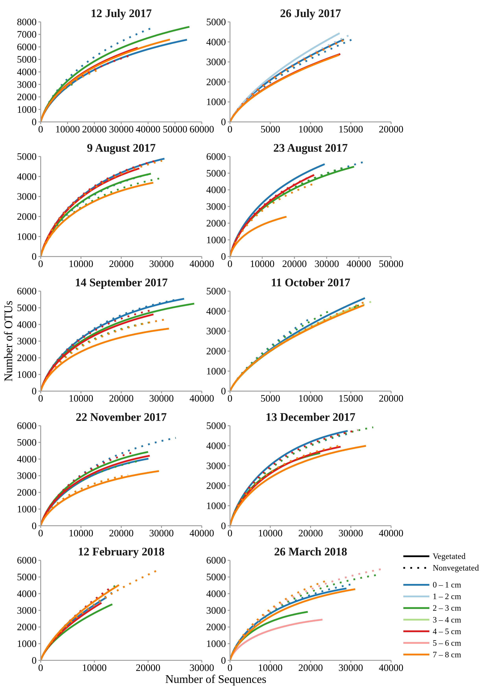
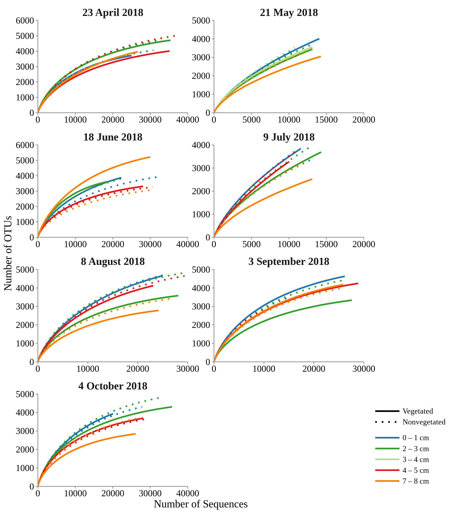

```{r knitr_settings, eval = TRUE, echo = FALSE, cache = FALSE, message = FALSE}
opts_chunk$set("tidy" = TRUE)
opts_chunk$set("echo" = FALSE)
opts_chunk$set("eval" = TRUE)
opts_chunk$set("warning" = FALSE)
opts_chunk$set("cache" = FALSE)
opts_chunk$set("message" = FALSE)

inline_hook <- function(x){
	print(x)
  
	if(is.list(x)){
		x <- unlist(x)
	}
  
	if(is.numeric(x)){
		if(abs(x - round(x)) < .Machine$double.eps ^ 0.5){
			paste(format(x,big.mark = ',', digits = 0, scientific = FALSE))
		} else {
			paste(format(x,big.mark = ',', digits = 1, nsmall = 1, scientific = FALSE))
		}
	} else {
    	paste(x)      
	}
}
knitr::knit_hooks$set(inline = inline_hook)

library("kableExtra")

```

\vspace{10mm}
Marsej Markovski^1^, Mirjana Najdek^1^, Gerhard J. Herndl^2,3^, and Marino Korlević^1$*$^ 

1\. Center for Marine Research, Ruđer Bošković Institute, Croatia

2\. Department of Functional and Evolutionary Ecology, University of Vienna, Austria

3\. Department of Marine Microbiology and Biogeochemistry, Royal Netherlands Institute for Sea Research (NIOZ), Utrecht University, The Netherlands

^$*$^To whom correspondence should be addressed:

Marino Korlević

G. Paliaga 5, 52210 Rovinj, Croatia

Tel.: +385 52 804 768

Fax: +385 52 804 780

e-mail: marino.korlevic@irb.hr

Running title: Compositional stability of sediment communities

[]: # (\linenumbers)
\sisetup{mode=text}
\setlength\parindent{24pt}

## Supplementary figures

```{r out.width="85%", fig.align="center", fig.cap="Rarefaction curves of sediment microbial communities sampled at the vegetated and nonvegetated site in the Bay of Saline from 12 July 2017 to 26 March 2018.\\label{rarefaction_a}", fig.pos="H"}

```

```{r out.width="85%", out.height="80%", fig.align="center", fig.cap="Rarefaction curves of sediment microbial communities sampled at the vegetated and nonvegetated site in the Bay of Saline from 23 April 2018 to 4 October 2018.\\label{rarefaction_b}", fig.pos="H"}

```

```{r out.width="90%", out.height="100%", fig.align="center", fig.cap="Temporal dynamics of the observed number of OTUs, Chao1, and ACE of sediment microbial communities sampled in different sediment layers of the vegetated and nonvegetated site in the Bay of Saline.\\label{estimators_moths}", fig.pos="H"}
include_graphics("../results/figures/estimators_months.jpg")
```

```{r out.width="90%", out.height="100%", fig.align="center", fig.cap="Temporal dynamics of the exponential Shannon diversity index and Inverse Simpson diversity index of sediment microbial communities sampled in different sediment layers of the vegetated and nonvegetated site in the Bay of Saline.\\label{indices_moths}", fig.pos="H"}

```

```{r out.width="100%", out.height="100%", fig.align="center", fig.cap="Shared sediment microbial communities (Bray-Curtis similarity coefficient) between different sediment layers and sites in the Bay of Saline.\\label{matrix}", fig.pos="H"}

```

```{r out.width="100%", out.height="90%", fig.align="center", fig.cap="Taxonomic classification and relative contribution of the most abundant bacterial and archaeal sequences ($\\geq$ 3 \\si{\\percent}) of each sample taken in different sediment layers from the vegetated and nonvegetated site in the Bay of Saline. No Relative (NR) -- sequences without known relatives.\\label{community_barplot_month}", fig.pos="H"}

```

\newpage
## Supplementary tables

```{r nseq_notus}
# Loading OTU/sample data
shared <- read_tsv("data/mothur/raw.trim.contigs.good.unique.good.filter.unique.precluster.pick.pick.pick.opti_mcc.shared")

# Calculating number of sequences and OTUs in each sample
nseq_notus <- shared %>%
  mutate(nseq = rowSums(select(., starts_with("Otu")))) %>%
  mutate(notus = rowSums(select(., starts_with("Otu")) != 0)) %>%
  select(Group, nseq, notus) %>%
  mutate(Group = as.character(Group))

# Loading metadata 
metadata <- read_tsv("data/raw/metadata.csv")

# Joining metadata with number of sequences and OTUs
invisible(Sys.setlocale(locale = "en_GB.utf8"))
metadata_nseq_notus <- inner_join(metadata, nseq_notus, by = c("ID" = "Group")) %>%
  select(ID, date, station, depth, nseq, notus) %>%
  mutate(date = as.Date(date, "%d.%m.%Y")) %>%
  mutate(date = format(date, "%d %B %Y")) %>%
  mutate(date = str_replace(date, "^0", "")) %>%
  mutate(station = str_replace(station, "^SCy$", "Vegetated")) %>%
  mutate(station = str_replace(station, "^SN$", "Nonvegetated")) %>%
  mutate(depth = str_replace(depth, "-", " – ")) %>%
  mutate(nseq = format(nseq, big.mark = ","), notus = format(notus, big.mark = ","))

# Generating the table
kable(metadata_nseq_notus, format = "latex", booktabs = TRUE, linesep = "", longtable = TRUE, escape = FALSE, col.names = c("Sample ID", "Date", "Site", "Sediment Depth", "No. of Sequences", "No. of OTUs"), caption = "Sample ID, sampling date and site, sediment depth, no. of sequences and no. of OTUs of each sample. The number of sequences and OTUs was calculated after exclusion of sequences without known relatives (no relative sequences) and eukaryotic, chloroplast and mitochondrial sequences.\\label{nseq_notus}", align = "c") %>%
  kable_styling(latex_options = c("hold_position", "repeat_header"), font_size = 9) %>%
  row_spec(0, bold = TRUE)

```

```{r estimators}
# Loading calculated estimators and indices
load("results/numerical/estimators_indices_metadata.Rdata")

#################################################################################################################
# Calculating statistics for estimators and indices of each area and layer in a for loop
#################################################################################################################

# Defining area names
areas <- c("SCy", "SN")

# Defining estimator/index names
estimator_index <- c("S.obs", "S.chao1", "S.ACE", "eshannon", "invsimpson")

for (i in areas) {

  # Defining object name for storing statistical results
  calculators_environment_test <- NULL
  
  # Selecting area
  estimators_indices_select <- estimators_indices_metadata %>%
  filter(station == i)

  for (j in estimator_index) {

    # Calculating statistics
    kruskal <- kruskal.test(formula = get(j) ~ layer, data = estimators_indices_select)
    pairwise.wilcox <- pairwise.wilcox.test(deframe(estimators_indices_select[, j]), estimators_indices_select$layer,
                                            p.adjust.method = "bonferroni", exact = FALSE)
    pairwise <- pairwise.wilcox$p.value %>%
      as_tibble(.name_repair = "check_unique", rownames = NA) %>%
      rownames_to_column("V")

    # Extracting statistical data
    test_data <-  tribble(~ parameter, ~ KW_H, ~ KW_df, ~ KW_p, ~ pairwise, ~ MW_p,
                          j, kruskal$statistic, kruskal$parameter, kruskal$p.value, "top – upper middle", filter(pairwise, V == "upper middle")$top,
                          j, kruskal$statistic, kruskal$parameter, kruskal$p.value, "top – lower middle", filter(pairwise, V == "top")$'lower middle',
                          j, kruskal$statistic, kruskal$parameter, kruskal$p.value, "top – bottom", filter(pairwise, V == "top")$bottom,
                          j, kruskal$statistic, kruskal$parameter, kruskal$p.value, "upper middle – lower middle", filter(pairwise, V == "upper middle")$'lower middle',
                          j, kruskal$statistic, kruskal$parameter, kruskal$p.value, "upper middle – bottom", filter(pairwise, V == "upper middle")$bottom,
                          j, kruskal$statistic, kruskal$parameter, kruskal$p.value, "lower middle – bottom", filter(pairwise, V == "lower middle")$bottom)

    # Combining statistical results
    calculators_environment_test <- rbind(calculators_environment_test, test_data)
    
    }

  # Formatting statistics table
  calculators_environment_test <- calculators_environment_test %>%
    mutate(pairwise = str_replace(pairwise, "top – upper middle", "Top Layer – Upper Middle Layer")) %>%
    mutate(pairwise = str_replace(pairwise, "top – lower middle", "Top Layer – Lower Middle Layer")) %>%
    mutate(pairwise = str_replace(pairwise, "top – bottom", "Top Layer – Bottom Layer")) %>%
    mutate(pairwise = str_replace(pairwise, "upper middle – lower middle", "Upper Middle Layer – Lower Middle Layer")) %>%
    mutate(pairwise = str_replace(pairwise, "upper middle – bottom", "Upper Middle Layer – Bottom Layer")) %>%
    mutate(pairwise = str_replace(pairwise, "lower middle – bottom", "Lower Middle Layer – Bottom Layer")) %>%
    mutate(KW_p = case_when(KW_p < 0.05 & KW_p >= 0.01 ~ "< 0.05",
                            KW_p < 0.01 & KW_p >= 0.001 ~ "< 0.01",
                            KW_p < 0.001 & KW_p >= 0.0001 ~ "< 0.001",
                            KW_p < 0.0001 ~ "< 0.0001",
                            TRUE ~ as.character(format(round(KW_p, 2), nsmall = 2, scientific = FALSE)))) %>%
    mutate(MW_p = case_when(MW_p < 0.05 & MW_p >= 0.01 ~ "< 0.05",
                            MW_p < 0.01 & MW_p >= 0.001 ~ "< 0.01",
                            MW_p < 0.001 & MW_p >= 0.0001 ~ "< 0.001",
                            MW_p < 0.0001 ~ "< 0.0001",
                            TRUE ~ as.character(format(round(MW_p, 2), nsmall = 2, scientific = FALSE)))) %>%
    mutate(parameter = str_replace(parameter, "S.obs", "Observed No. of OTUs")) %>%
    mutate(parameter = str_replace(parameter, "S.chao1", "Chao1")) %>%
    mutate(parameter = str_replace(parameter, "S.ACE", "ACE")) %>%
    mutate(parameter = str_replace(parameter, "eshannon", "Exponential Shannon")) %>%
    mutate(parameter = str_replace(parameter, "invsimpson", "Inverse Simpson")) %>%
    mutate(KW_H = format(KW_H, digits = 1, nsmall = 1))

  # Setting names for objects created in loop
  assign(paste0("calculators_environment_test", sep = "_", i), calculators_environment_test)
  
  }

# Generating table for vegetated area
calculator_statistics <- kable(calculators_environment_test_SCy, format = "latex", booktabs = TRUE, linesep = "", longtable = TRUE, escape = FALSE, col.names = c("Parameter", "\\textit{H}", "\\textit{df}", "\\textit{p}", "Comparisons Between Sediment Layers", "\\textit{p}"), caption = "Statistic of richness estimator and diversity index parameters of sediment microbial communities sampled in different sediment layers of the vegetated site in the Bay of Saline. Parameters were tested by applying the Kruskal-Wallis \\textit{H} test followed by a pairwise comparison using the Mann-Whitney \\textit{U} test. Bonferroni correction was used to address the problem of multiple comparisons.\\label{calculator_statistics}", align = "c") %>%
  add_header_above(c(" ", "Kruskal-Wallis \\\\textit{H} test" = 3, "Mann-Whitney \\\\textit{U} test" = 2), bold = TRUE, escape = FALSE) %>%
  kable_styling(latex_options = c("hold_position", "repeat_header"), font_size = 9) %>%
  row_spec(0, bold = TRUE) %>%
  column_spec(1, width = "8.5em", latex_valign = "m") %>%
  column_spec(c(2:4, 6), width = "4em", latex_valign = "m") %>%
  column_spec(5, width = "20em", latex_valign = "m") %>%
  collapse_rows(columns = 1, valign = "middle", latex_hline = "major")

# Saving
cat(calculator_statistics, file = "results/numerical/calculator_statistics_SCy.tex")

# Merging rows in column H, df and p by parameter
system("sed -i -r 's/^ &([^&]* &){3}/ \\& \\&  \\&  \\&/' results/numerical/calculator_statistics_SCy.tex")
system("sed -i -r 's/(\\\\multirow\\{-6\\}\\{8.5em\\}\\{\\\\centering\\\\arraybackslash.*)\\} &([^&]* )&([^&]* )&([^&]* )&/\\1} \\& \\\\multirow{-6}{*}{\\\\centering\\\\arraybackslash\\2} \\& \\\\multirow{-6}{*}{\\\\centering\\\\arraybackslash\\3} \\& \\\\multirow{-6}{*}{\\\\centering\\\\arraybackslash\\4} \\&/' results/numerical/calculator_statistics_SCy.tex")

# Generating table for nonvegetated area
calculator_statistics <- kable(calculators_environment_test_SN, format = "latex", booktabs = TRUE, linesep = "", longtable = TRUE, escape = FALSE, col.names = c("Parameter", "\\textit{H}", "\\textit{df}", "\\textit{p}", "Comparisons Between Sediment Layers", "\\textit{p}"), caption = "Statistic of richness estimator and diversity index parameters of sediment microbial communities sampled in different sediment layers of the nonvegetated site in the Bay of Saline. Parameters were tested by applying the Kruskal-Wallis \\textit{H} test followed by a pairwise comparison using the Mann-Whitney \\textit{U} test. Bonferroni correction was used to address the problem of multiple comparisons.\\label{calculator_statisticsN}", align = "c") %>%
  add_header_above(c(" ", "Kruskal-Wallis \\\\textit{H} test" = 3, "Mann-Whitney \\\\textit{U} test" = 2), bold = TRUE, escape = FALSE) %>%
  kable_styling(latex_options = c("hold_position", "repeat_header"), font_size = 9) %>%
  row_spec(0, bold = TRUE) %>%
  column_spec(1, width = "10.5em", latex_valign = "m") %>%
  column_spec(c(2:4, 6), width = "3em", latex_valign = "m") %>%
  column_spec(5, width = "22em", latex_valign = "m") %>%
  collapse_rows(columns = 1, valign = "middle", latex_hline = "major")

# Saving
cat(calculator_statistics, file = "results/numerical/calculator_statistics_SN.tex")

# Merging rows in column H, df and p by parameter
system("sed -i -r 's/^ &([^&]* &){3}/ \\& \\&  \\&  \\&/' results/numerical/calculator_statistics_SN.tex")
system("sed -i -r 's/(\\\\multirow\\{-6\\}\\{10.5em\\}\\{\\\\centering\\\\arraybackslash.*)\\} &([^&]* )&([^&]* )&([^&]* )&/\\1} \\& \\\\multirow{-6}{*}{\\\\centering\\\\arraybackslash\\2} \\& \\\\multirow{-6}{*}{\\\\centering\\\\arraybackslash\\3} \\& \\\\multirow{-6}{*}{\\\\centering\\\\arraybackslash\\4} \\&/' results/numerical/calculator_statistics_SN.tex")

```

\input{../results/numerical/calculator_statistics_SCy.tex}

\newpage

\input{../results/numerical/calculator_statistics_SN.tex}
